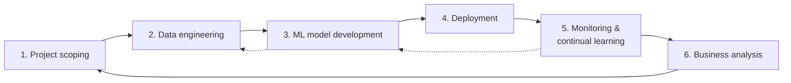
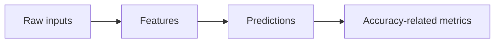
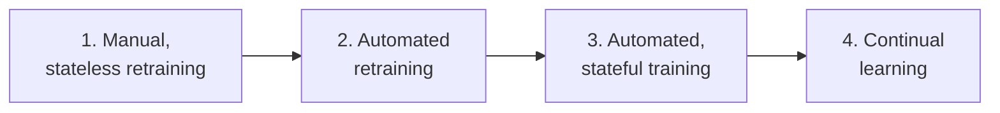
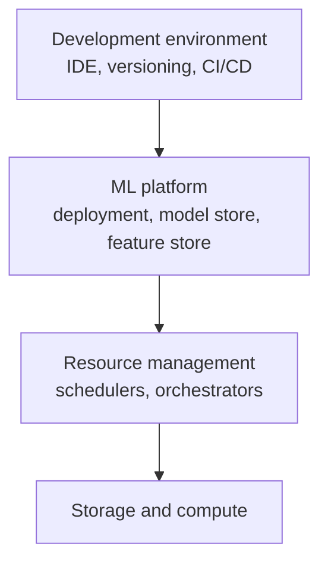

# Designing Machine Learning Systems — Chapter Notes

Sep 24, 2026 · @Mahmud Hasan

## About the book

*Designing Machine Learning Systems* by Chip Huyen (O'Reilly, 2022) treats an ML system as a whole — business requirements, data, features, models, deployment, monitoring, infrastructure and people — not just the algorithm. Its core argument: the model is a small part of a production ML system, and most of the hard problems live around it.

Each chapter below has its main ideas, key terms, frameworks and examples from the book, and a short list of takeaways. The book's recurring loop is: frame the problem → get and process data → engineer features → develop and evaluate models → deploy → monitor → continually update → repeat.

## Chapter 1 — Overview of Machine Learning Systems

**Core idea:** An ML system is far more than an algorithm. It includes business requirements, user/developer interfaces, the data stack, logic for developing, monitoring and updating models, and the infrastructure to deliver all of it. **MLOps** = tools and best practices to bring ML into production (deploy, monitor, maintain). **ML systems design** = a *system* approach to MLOps, making all components and stakeholders work together toward stated objectives.

### When to use ML

Definition used in the book: ML is an approach to **(1) learn (2) complex patterns from (3) existing data** and use these patterns to make **(4) predictions** on **(5) unseen data**.

1. **Learn** — the system must have capacity to learn (a relational database doesn't). In supervised learning it learns from input–output pairs (e.g., Airbnb listing features → rental price).
2. **Complex patterns** — there must be a pattern, and it must be complex. A fair die has a distribution but no pattern. Zip code → state is simple: use a lookup table. Price from many listing features is complex: use ML ("Software 2.0"). What is complex for machines differs from what is complex for humans.
3. **Existing data** — data must exist or be collectable. Zero-shot learning still relies on data from related tasks. Continual learning can launch without data but risks poor UX. "Fake it till you make it": serve human predictions first, collect data, train later.
4. **Predictions** — the problem must be predictive. Many problems can be reframed as "what would the answer be?", including compute-heavy ones (e.g., approximating image denoising / screen-space shading).
5. **Unseen data shares patterns with training data** — i.e., similar distributions. A 2008-trained app-download model fails in 2020. When assumptions break, monitoring (Ch. 8) and test in production (Ch. 9) catch it.

ML shines further when the task is:

- **Repetitive** — models need many examples of each pattern.
- **Cheap to get wrong** — e.g., recommender systems. If mistakes are catastrophic, ML can still fit if average benefit outweighs cost (self-driving cars).
- **At scale** — heavy up-front investment pays off over many predictions; scale also means more data. A "single" prediction (election winner) is often a series of updated predictions.
- **Patterns constantly change** — e.g., spam. Hand-written rules go stale; ML can be retrained on new data.

**Don't use ML when:** it's unethical, a simpler solution works (Ch. 6: start with non-ML baselines), or it isn't cost-effective. If ML can't solve the whole problem, it may solve a part (e.g., route a query to an FAQ vs. a human). Don't dismiss a technology only because it's not cost-effective *yet*.

### Use cases

- **Consumer:** search, recommender systems, predictive typing, photo enhancement, face/fingerprint unlock, machine translation, smart assistants, fall detection.
- **Enterprise (the majority):** usually stricter accuracy but more forgiving latency. A 0.1% efficiency gain in resource allocation can be worth millions.
  - **Fraud detection** — one of the oldest uses; anomaly detection on transactions.
  - **Price optimization** — best for many transactions, fluctuating demand, dynamic prices (ads, flights, ride-sharing).
  - **Demand forecasting** — budgets, inventory, resources.
  - **Customer acquisition** — avg. cost \~$86.61 per paying app user (2019); Lyft \~$158/rider.
  - **Churn prediction** — acquiring a user costs 5–25× more than retaining one; also used for employees.
  - **Support ticket classification**, **brand monitoring** (sentiment), **health care** (usually delivered via providers due to accuracy and privacy needs).

### ML in research vs. production

| Aspect | Research | Production |
| --- | --- | --- |
| Requirements | SOTA on benchmark datasets | Different stakeholders, different (often conflicting) requirements |
| Computational priority | Fast training, high throughput | Fast inference, low latency |
| Data | Static | Constantly shifting |
| Fairness | Often not a focus | Must be considered |
| Interpretability | Often not a focus | Must be considered |

**Stakeholders example (restaurant recommender, app earns 10% per order):** ML engineers want the most-likely-ordered restaurants; sales wants expensive restaurants; product wants <100 ms latency; platform team wants to pause updates to fix scaling; manager wants margin. Know how strict each requirement is (must-have vs. nice-to-have). Solution previewed in Ch. 2: one model per objective, then combine.

- **Ensembling** wins competitions (e.g., Netflix Prize) but is rare in production — slower and harder to interpret.
- Small gains matter sometimes (0.2% CTR → millions), but if users won't notice, a complex model must be *significantly* better to justify itself.
- **Leaderboard criticism:** hard steps are done for you; multiple teams on one test set means winners can win by chance; benchmarks reward accuracy over compactness, fairness, energy efficiency.

**Latency vs. throughput**

- Latency = time from query to result; throughput = queries processed per unit time.
- One-at-a-time: 10 ms latency → 100 q/s. With batching, higher latency can mean higher throughput: 50 queries per 20 ms batch → 2,500 q/s.
- Latency matters: Akamai (2017) — 100 ms delay can cut conversions 7%; Booking.com — \~30% more latency cost \~0.5% conversion; Google — over half of mobile users leave pages taking >3 s.
- **Latency is a distribution, not a number.** Averages mislead (one 3,000 ms outlier makes the mean 390 ms). Use percentiles: p50 (median), p90, p95, p99. High percentiles often hit your most valuable users (Amazon customers with the most purchase data). Requirements are often set on p90/p99.9.

**Data:** research data is clean, static, well known. Production data is noisy, unstructured, shifting, biased in unknown ways, with sparse/imbalanced/incorrect labels, privacy constraints, and constantly generated by users, systems and third parties.

**Fairness:** models encode the past and discriminate at scale (loans, resumes, mortgages, predictive policing). Berkeley study: 1.3M creditworthy Black and Latino applicants rejected 2008–2015. Misclassifying minorities barely moves aggregate metrics. In 2019 only 13% of large companies reported mitigating bias.

**Interpretability:** Hinton's "AI surgeon, 90% vs. human 80%" question split executives 50/50. Interpretability builds trust, surfaces bias, and helps developers debug. In 2019 only 19% of large companies worked on explainability.

**Discussion:** most ML jobs are, and will be, in productionizing ML, not pure research.

### ML systems vs. traditional software

- SWE assumes code and data are separate; ML systems are **part code, part data, part artifacts** created from both.
- Companies with the best data win, so focus shifts to improving data. Data changes fast → faster dev/deploy cycles.
- You must **test and version data** too — hard. Not all samples are equal (a rare cancerous scan is worth more than another normal one). Accepting all data risks harm and **data poisoning**.
- **Model size:** hundreds of millions to billions of parameters → GBs of RAM; hard on edge devices; must be fast enough to be useful (autocomplete slower than typing is useless).
- **Monitoring and debugging** complex models is hard.
- Progress is fast: BERT-large (340M params, 1.35 GB) was called impractical in 2018; by 2020 it powered almost every English Google search.

### Takeaways

- Ask first whether ML is necessary and cost-effective; ML may solve only part of a problem.
- Production ML is shaped by stakeholders, latency, shifting data, fairness and interpretability — not just accuracy.
- Think in latency percentiles, not averages.
- Data is a first-class component: version it, test it, and watch for poisoning.

## Chapter 2 — Introduction to Machine Learning Systems Design

**Core idea:** Before building a model, know *why* (business objectives), *what good looks like* (requirements), *how you'll iterate* (process), and *what ML task you're actually solving* (framing). Data matters enormously.

### Business and ML objectives

- Data scientists care about ML metrics (accuracy, F1, latency). Companies care about **business metrics**. A 94% → 94.2% accuracy gain is worthless unless it moves a business metric. Projects that chase ML metrics alone get killed.
- Per Milton Friedman, a business exists to maximize profit — directly (sales, cost cutting) or indirectly (satisfaction, time on site). Tie ML performance to business performance (ad revenue, monthly active users).
- Ad CTR and fraud detection are popular partly because ML metrics map directly to money.
- Companies invent bridging metrics. **Netflix take-rate** = quality plays ÷ recommendations seen; higher take-rate → more streaming hours, fewer cancellations.
- The effect can be ambiguous (personalization may make users spend more, or solve problems faster so they spend less). Use **experiments (A/B tests)**; pick the model with better business metrics, even if its ML metrics are worse.
- In complex pipelines (e.g., cybersecurity: anomaly model → rules → human experts → mitigation), attribution to the ML part may be impossible.
- Be realistic: ML can transform a business “magically: possible. Overnight: no.” ROI grows with adoption maturity — Algorithmia 2020: \~75% of mature adopters (5+ years) deploy a model in <30 days; 60% of beginners take >30 days.

### Four requirements for ML systems

1. **Reliability** — keeps performing correctly despite hardware/software faults or human error. Hard for ML: without ground truth you can't tell a prediction is wrong, and ML **fails silently** (no crash or 404; e.g., a bad translation you can't read).
2. **Scalability** — growth in model complexity (1 GB logistic regression → 16 GB neural net), traffic (10K → 1–10M requests/day), and **model count** (one startup had 8,000 models for 8,000 enterprise customers).
   - Resource scaling: up-scaling and down-scaling (e.g., 100 GPUs at peak, 10 normally). **Autoscaling** is hard — Amazon's failed on Prime Day; one hour of downtime cost an estimated $72–99M.
   - Scaling out = add parallel components; scaling up = make one component bigger.
   - **Artifact management:** 100 models need automated monitoring, retraining and reproducibility.
3. **Maintainability** — ML engineers, DevOps and subject matter experts (SMEs) use different tools. Let each use familiar tools; document code; version code, data and artifacts; make models reproducible; debug together without finger-pointing.
4. **Adaptability** — detect improvement opportunities and update without service interruption, since data and business requirements shift. Tightly linked to maintainability.

### The iterative process

Developing an ML system is a never-ending cycle, not a line. Example (ad-display model): pick metric (impressions) → collect data/labels → features → train → find wrong labels, relabel → retrain → find 99.99% negative labels, collect positives → retrain → model is stale on yesterday's data, update → deploy → revenue drops because ads shown but not clicked → switch metric to CTR → back to step 1.



The six steps, with the chapters that cover them: scoping (goals, constraints, stakeholders, resources; Ch. 1, 2, 11) → data engineering (Ch. 3, 4) → model development (features Ch. 5; selection, training, evaluation Ch. 6) → deployment (Ch. 7) → monitoring and continual learning (Ch. 8, 9) → business analysis (evaluate against goals, kill or start projects).

### Framing ML problems

An ML problem is defined by **inputs, outputs, and an objective function**. “Slow customer support” is not an ML problem. Example: the bottleneck is routing requests to 4 departments (accounting, inventory, HR, IT) → a classification problem: input = request, output = department, objective = minimize difference between predicted and actual department.

**Types of ML tasks**

- **Classification vs. regression** — categories vs. continuous values. Each can be reframed as the other: bucket house prices into ranges; output a spam score in \[0, 1\] and apply a threshold (e.g., 0.5).
- **Binary vs. multiclass** — binary is simplest (toxic comment, cancer scan, fraud); F1 and confusion matrices are more intuitive. **High cardinality** (thousands of diseases, tens of thousands of products) is hard: rule of thumb \~100 examples per class → 1,000 classes needs ≥100K examples; rare classes are hard to collect.
- **Hierarchical classification** — classify into a big group first (electronics, home, fashion, pets), then a subgroup (shoes, shirts…).
- **Multiclass vs. multilabel** — multilabel: an example can have several classes (an article in tech *and* finance). Two approaches: multi-hot label vector (\[0,1,1,0\]), or one binary classifier per class. Multilabel causes the most trouble: annotator disagreement on how many labels (label multiplicity), and choosing how many top probabilities to keep from e.g. \[0.45, 0.2, 0.02, 0.33\].
- **Framing changes difficulty.** Predicting the next app: multiclass over N apps means retraining whenever an app is added. Better: **regression** with user + environment + *app* features → one score in \[0, 1\] per app. New apps need no retraining.

**Task types in more detail.** The task type fixes three things: what the model outputs, the loss it trains on, and the metric you report.

| Task type | Model outputs | Typical loss | Metrics | Examples | Watch out for |
| --- | --- | --- | --- | --- | --- |
| Regression | One real number | MSE, MAE, Huber | MAE, RMSE, MAPE, % within ±X% | House price, trip duration, demand | Outliers dominate MSE; skewed targets (prices, durations) train better on log(y) |
| Binary classification | P(positive), then a threshold | Log loss (binary cross-entropy) | Precision, recall, F1, PR-AUC, ROC-AUC | Spam, fraud, churn, toxic comment | Class imbalance makes accuracy meaningless; the threshold is a business decision |
| Multiclass | One of K classes (softmax over K) | Cross-entropy | Accuracy, macro-F1, top-k accuracy, confusion matrix | Language ID, product category, disease | High cardinality; rare classes; a new class means retraining the output layer |
| Multilabel | Any subset of K classes (K independent sigmoids) | Binary cross-entropy per label | Per-label precision/recall, Hamming loss, precision@k | Article topics, image tags | Label multiplicity (annotators disagree on how many labels); picking thresholds or k |
| Hierarchical | A path through a class tree | Cross-entropy at each level | Accuracy per level | Product taxonomy (fashion → shoes → sneakers) | An error at the top level makes everything below it wrong |

- **Reframing regression as classification (bucketing).** Useful when the downstream decision is categorical anyway ("under / over 30 min") or the target is very noisy. Costs: bucket boundaries are arbitrary, and a plain multiclass loss treats "off by one bucket" the same as "off by five". Use ordinal classification if order matters.
- **Reframing classification as regression (scoring).** Predict a score in \[0, 1\], then threshold it. Keep the score, not just the label: it lets you rank, set thresholds per use case and move them without retraining.
- **Choosing the threshold.** 0.5 is rarely right. Pick it from the precision–recall curve using the cost of a false positive vs a false negative (e.g., missed fraud vs a blocked honest customer). If other systems consume the probability itself, calibrate it first (Platt scaling or isotonic regression), especially after under/over-sampling.
- **Handling high cardinality.**
  - Go hierarchical: a coarse classifier first, then one per group.
  - Merge very rare classes into "other" until they have enough data.
  - Collect more data for rare classes (active learning helps).
  - For very large K (products, songs), replace the softmax with retrieval: embed items and queries, return the nearest items. This is the recommender-system framing.
- **Multilabel decisions.** Either a threshold per label (tuned on validation, labels differ in frequency) or a fixed top-k. Write labeling guidelines that say how many labels an example should get; this is where annotator disagreement starts.
- **Why the next-app framing scales.** Multiclass over N apps fixes the output layer's size, so every new app means retraining. The scoring framing (user + context + *app* features → one score) handles a new app like any other input: score every candidate, show the top k. The same idea underlies most ranking and recommendation systems.
- **In the hands-on project (TaxiETA):** trip duration is regression on log(duration), which keeps relative errors comparable between short and long trips. The side task "will this trip take over an hour?" is binary classification with heavy imbalance (\~2% positives). Bucketing the ETA into "<10 / 10–20 / >20 min" would throw away precision riders care about.

**Objective (loss) functions**

- Supervised loss compares outputs to ground truth: RMSE or MAE for regression, log loss for binary, cross entropy for multiclass. E.g., cross entropy of \[0.45, 0.2, 0.02, 0.33\] vs. true \[0, 0, 0, 1\].
- Objective *functions* (math) differ from business/ML *objectives*.

**Decoupling objectives.** Newsfeed ranking: filter spam, NSFW, misinformation; rank by quality and by engagement. Engagement alone promotes extreme content, so quality and engagement conflict.

- Option A — one model, combined loss: `loss = α·quality_loss + β·engagement_loss`. Tune α, β (randomly or via **Pareto optimization**) — but every change requires retraining.
- Option B (preferred) — two models (quality\_model, engagement\_model), rank by `α·quality_score + β·engagement_score`. Tweak α, β without retraining.
- Decoupling also allows different maintenance schedules (spam evolves faster than perceived quality).

**The newsfeed example, step by step.** The goal is "maximize user engagement while minimizing the spread of extreme views and misinformation". That single sentence hides several objectives that pull in different directions.

1. **Filter** what must never be shown: spam, NSFW content, misinformation. These are hard constraints, so they're filters (a yes/no gate), not scores to trade off.
2. **Rank** what's left. Engagement alone (the chance a user clicks, likes or shares) rewards the most extreme posts, because they get the most reactions. So add a second objective: **quality**, e.g. how likely a human rater would call the post high-quality or trustworthy.
3. The two conflict: the most engaging post is often not the highest quality. A single "best" ranking doesn't exist; there is only a trade-off you choose.

**Why Option B (two models) usually wins:**

|  | Option A: one model, combined loss | Option B: two models, combined score |
| --- | --- | --- |
| Change the trade-off (α, β) | Retrain the whole model | Change two numbers at serving time |
| Try several trade-offs in A/B tests | One training run per variant | Same two models, different weights per arm |
| Update one objective | Retrain everything | Retrain only that model, on its own schedule |
| Labels | Need both labels on the same examples | Each model uses the data that fits it (clicks for engagement, rater labels for quality) |
| Debugging | Hard to tell which objective moved | Each score can be monitored on its own |

**Worked example.** Post X has quality 0.3 and engagement 0.9; post Y has quality 0.8 and engagement 0.5. With α = β = 0.5, X scores 0.60 and Y scores 0.65, so Y ranks first. With α = 0.2, β = 0.8, X scores 0.78 and Y 0.56, so X wins. The models didn't change, only the product decision about how much quality matters.

**Choosing α and β.** Plot each candidate weighting as a point (average quality, average engagement) on a validation set. The **Pareto front** is the set of weightings where you can't improve one objective without hurting the other. Any point off the front is strictly worse. Picking a point on the front is a product/policy decision; confirm it with an online A/B test, since offline scores are proxies.

**Practical cautions:**

- Put the scores on the same scale before mixing them (calibrated probabilities, or percentiles). Otherwise the weights mean nothing: a score that ranges 0–100 swamps one that ranges 0–1.
- The weights encode values (how much engagement you'll trade for quality), so document who chose them and why.
- Maintenance schedules differ: spam tactics change daily, so the spam filter retrains often; perceived quality drifts slowly, so its model can retrain monthly. With one combined model, the fastest-changing objective would force retraining everything.
- The same pattern shows up elsewhere: ads (relevance vs revenue), search (relevance vs freshness), ride-hailing dispatch (pickup time vs driver earnings vs fairness).

### Mind versus data

- **Mind camp:** Judea Pearl (“Data is profoundly dumb”; predicted data-centric ML folks would be jobless in 3–5 years). Christopher Manning: huge compute + data + simple algorithm = bad learners; structure lets systems learn more from less.
- **Data camp:** Richard Sutton's “The Bitter Lesson” — general methods that leverage computation win by a large margin. Peter Norvig: “We don't have better algorithms. We just have more data.” Monica Rogati's data science hierarchy of needs: data is the foundation.
- The debate is whether **finite** data is *sufficient*, not whether it's necessary.
- Datasets keep growing: One Billion Word Benchmark (2013) 0.8B tokens → GPT-2 (2019) 10B → GPT-3 (2020) 500B.
- But more low-quality data (outdated, mislabeled) can hurt performance.

### Takeaways

- Start from business objectives and translate them into ML objectives; validate with experiments.
- Design for reliability, scalability, maintainability and adaptability.
- Expect a cycle, not a pipeline.
- Framing (inputs, outputs, loss) can make a problem much easier; decouple conflicting objectives into separate models.

## Chapter 3 — Data Engineering Fundamentals

**Core idea:** To build production ML you need to know where data comes from, how it's formatted and modeled, where it's stored and processed, how it flows between services, and the difference between batch and streaming data.

### Data sources

- **User input data** — text, images, files typed or uploaded by users. If users *can* enter wrong data, they will: needs heavy validation. Users expect fast responses → fast processing.
- **System-generated data** — logs (memory, instances, services called, job results) and model predictions. Rarely malformatted; often processed hourly/daily, though fast processing helps catch “interesting” (i.e., catastrophic) events. Teams “log everything”, so volume explodes: signal gets lost in noise (tools like Logstash, Datadog, Logz.io help) and storage grows — keep logs only while useful, use cheap low-access storage (S3 Standard \~5× the per-GB cost of S3 Glacier).
- **User behavior data** (clicks, scrolls, dwell time) is system-generated but still *user data* subject to privacy rules — browsing and purchase history is highly personal.
- **Internal databases** — inventory, CRM, users. E.g., Amazon detects query intent (“frozen” = food or Disney?) then checks inventory before ranking.
- **Third-party data** — first-party (your own users), second-party (another company's data about its customers, usually paid), third-party (vendors collect data on the public). Advertiser IDs (Apple IDFA, Android AAID) made this easy; Apple made IDFA opt-in in early 2021, pushing firms to first-party data (workarounds like China's CAID fingerprinting appeared).

### Data formats

**Serialization** = converting a data structure/object into a format that can be stored or transmitted and later reconstructed. Consider human readability, access patterns, text vs. binary.

| Format | Binary/Text | Human-readable | Typical use |
| --- | --- | --- | --- |
| JSON | Text | Yes | Everywhere |
| CSV | Text | Yes | Everywhere |
| Parquet | Binary | No | Hadoop, Amazon Redshift |
| Avro | Binary primary | No | Hadoop |
| Protobuf | Binary primary | No | Google, TensorFlow (TFRecord) |
| Pickle | Binary | No | Python, PyTorch serialization |

- **JSON** — language-independent, human-readable key–value format handling any level of structure. Painful to change schema later; text → large files.
- **Row-major (CSV) vs. column-major (Parquet):** consecutive row elements vs. column elements stored together. Row-major → faster row access and **faster writes** (appending examples). Column-major → faster **column reads** (e.g., 4 of 1,000 ride features).
- **pandas vs. NumPy:** pandas DataFrame is column-major; NumPy ndarray is row-major by default. Iterating a DataFrame by row took 2.41 s vs. 0.07 s by column — convert to NumPy for row access.
- CSV criticism: poor serialization of non-text values (float precision loss).
- **Text vs. binary:** binary is compact — 1000000 is 7 bytes as text, 4 bytes as int32. A 14 MB CSV became 6 MB as Parquet. AWS: Parquet up to 2× faster to unload and up to 6× less S3 storage.

### Data models

A data model describes how data is represented; the choice affects what problems you can solve (a car by make/model/price helps buyers; by owner/plate/addresses helps police).

**Relational model** (Codd, 1970) — data in *relations* (unordered sets of tuples; shown as tables).

- **Normalization** (1NF, 2NF…) reduces redundancy and improves integrity: e.g., move publisher name/country into a Publisher table so a rename touches one row. Downside: data spread across tables, and **joins are expensive** on large tables.
- **SQL** is **declarative** (say *what* you want) vs. imperative Python (say *how*). The **query optimizer** decides execution — among the hardest problems in databases (ML can help, e.g., Neo). SQL can be Turing-complete but queries can become unmaintainable (one 700-line query over 27 tables took 3 days).
- **Declarative ML** (Ludwig at Uber, H2O AutoML): declare features schema + task, the system finds the model. Useful, but it abstracts the *easy* part — the hard parts are feature engineering, data processing, evaluation, shift detection, continual learning.

**NoSQL** (“Not Only SQL”) — arose from schema-management pain (#1 reason in a 2014 Couchbase survey).

- **Document model** — self-contained documents (JSON, XML, BSON) with unique keys; a collection ≈ table but documents can have different schemas. Called “schemaless”, but really **schema-on-read**: the reader assumes structure. Better **locality** (one doc per book); worse **joins** (“books under $25” scans all docs). PostgreSQL and MySQL support both models.
- **Graph model** — nodes + edges; relationships are the priority. Queries with an unknown number of hops (“everyone born in the USA” via born\_in → within edges) are easy in a graph, hard in SQL or documents.

**Structured vs. unstructured data**

| Structured | Unstructured |
| --- | --- |
| Schema clearly defined | Doesn't have to follow a schema |
| Easy to search and analyze | Fast arrival |
| Only handles data with the schema | Handles data from any source |
| Schema changes cause trouble | Schema worries shift to downstream readers |
| Stored in **data warehouses** | Stored in **data lakes** |

Schema-change bug example: null ages replaced with 0 made the model think 0-year-olds made transactions (fixed by using –1). The real distinction: structured = the *writer* assumes structure; unstructured = the *reader* does.

### Data storage engines and processing

**OLTP (online transaction processing)** — inserts/updates/deletes as transactions happen (tweets, rides, uploads). Needs **low latency** and **high availability**. Usually **row-major**.

- **ACID:** *Atomicity* (all steps succeed or all fail — no driver if payment fails); *Consistency* (transactions follow rules — valid user); *Isolation* (concurrent transactions act as if isolated — no double-booking a driver); *Durability* (committed stays committed — ride still comes if your phone dies).
- **BASE** (Basically Available, Soft state, Eventual consistency) for non-ACID systems.

**OLAP (online analytical processing)** — aggregating columns across many rows (“average ride price in SF in September”).

Why OLTP/OLAP are outdated terms:

1. The technical separation is closing — CockroachDB (transactional handling analytics), Apache Iceberg and DuckDB (analytical handling transactions).
2. **Decoupling storage from compute** (BigQuery, Snowflake, IBM, Teradata): store once, optimize processing per query type.
3. “Online” is overloaded: internet-connected, in production, or a speed tier — **online** (immediately available), **nearline** (available quickly without humans), **offline** (needs human intervention).

**OLTP vs OLAP in more detail.** The difference is the *workload*: many small reads and writes of whole records, versus a few huge reads of a few columns.

|  | OLTP (transactional) | OLAP (analytical) |
| --- | --- | --- |
| Typical operation | Insert/update/read one record: "create ride 812", "mark ride 812 completed" | Aggregate one column over millions of rows: "average fare per borough last month" |
| Rows touched per query | 1 to a few | Millions to billions |
| Columns touched | Most columns of that row | A few columns of every row |
| What matters | Latency (ms), high availability, correctness under concurrency (ACID) | Throughput: scanning lots of data fast |
| Writes | Constant, small, concurrent | Bulk loads (hourly/daily batches) |
| Storage layout | Row-major: a row's fields sit together, so writing/reading one record is one lookup | Column-major: a column's values sit together, so a query reads only the columns it needs, and similar values compress well |
| Examples | PostgreSQL, MySQL, CockroachDB, DynamoDB | BigQuery, Snowflake, Redshift, ClickHouse, DuckDB; Parquet files in a data lake |

**Why row vs column layout matters.** Take a rides table with 20 columns and 1 billion rows. "Average fare" in a row store must read every row (all 20 fields) to pick out one field: about 20× more data than needed. A column store reads just the `fare` column, often compressed 5–10× because values are similar. The reverse holds for OLTP: fetching all 20 fields of ride 812 from a column store means 20 separate lookups, one per column file.

**Why they were kept in separate systems.** Running a heavy analytical scan on the production transactional database slows down the live app (riders waiting on a query that averages a year of fares). So companies copy data from OLTP databases into an OLAP warehouse, traditionally with nightly ETL. That copy is also why analytics data is usually hours or a day behind.

**Where each shows up in an ML system:**

- **OLTP / online stores:** everything on the request path. The app's own database (users, rides), the online feature store (latest feature values per entity, read in milliseconds at prediction time), the prediction log (one write per prediction).
- **OLAP / warehouse / lake:** everything that looks at history. Building training sets, computing aggregate features ("median trip time per zone pair over 28 days"), evaluation and slice analysis, monitoring dashboards.
- The two meet in a feature store: batch features are computed in OLAP and **materialized** (copied) into the online store for fast serving. Keeping the two copies consistent is a classic source of train/serve skew.

**What "outdated" means in practice.** The line between the two is blurring (points 1–3 above). **HTAP** (hybrid transactional/analytical processing) databases try to serve both workloads from one system, and lakehouse formats (Iceberg, Delta Lake) add transactions to analytical storage. The workload distinction still matters, though. Even when one product serves both, you choose layout, indexes and hardware by the access pattern: point lookups vs scans.

**ETL (Extract, Transform, Load)**

- **Extract** — pull from sources; validate and reject malformed data early (and notify sources).
- **Transform** — the meaty part: join, clean, standardize values (“Male”/“M”/“1”), transpose, dedupe, sort, aggregate, derive features, validate.
- **Load** — decide how and how often to write into a file, database or warehouse.
- **ELT** — load raw data into a lake first, transform later: fast arrival but inefficient to search massive raw data. As schemas standardize, committing to schema is feasible again. **Data lakehouses** (Databricks, Snowflake) combine lake flexibility with warehouse management.

**Warehouse, lake, lakehouse.** A lakehouse keeps data as cheap open files in object storage (like a lake), and adds a management layer that gives it warehouse behaviour.

|  | Data warehouse | Data lake | Lakehouse |
| --- | --- | --- | --- |
| What's stored | Cleaned, structured tables (schema on write) | Anything raw: JSON, logs, images, CSV, Parquet (schema on read) | Open files (mostly Parquet) plus a table layer on top |
| Storage | Inside the warehouse, proprietary format | Cheap object storage (S3, GCS, ADLS) | Cheap object storage, open formats |
| Transactions / updates | Yes (ACID) | No: files are just written and overwritten | Yes, via the table format's transaction log |
| Schema | Enforced | Not enforced; easy to end up with a "data swamp" | Enforced, with controlled schema evolution |
| Who uses it | BI, SQL analysts | Data engineers, ML on raw data | Both, from one copy of the data |

**How a lakehouse works.**

- **Open file format:** data is stored as Parquet (column-oriented, compressed).
- **Open table format:** Delta Lake (created by Databricks), Apache Iceberg or Apache Hudi. It keeps a *transaction log / metadata* that says which files make up the table at each version. This gives:
  - **ACID transactions:** readers never see half-written data, and concurrent writers don't corrupt each other.
  - **Schema enforcement and evolution:** bad writes are rejected; adding a column is a tracked change.
  - **Updates and deletes** (e.g., GDPR deletion requests) without rewriting the whole dataset by hand.
  - **Time travel:** query the table *as of* a past version or timestamp.
  - **Statistics for skipping files** (min/max per column), so queries read only relevant files.
- **Any compute engine** can read the same tables: Spark, Trino, Flink, DuckDB, or a warehouse engine. Storage and compute are decoupled.
- **Vendors:** Databricks is built around Delta Lake. Snowflake started as a warehouse and now also manages Iceberg tables on your storage. Cloud warehouses (BigQuery, Redshift) likewise read open table formats.

&#91;embedded content: lakehouse layers · storage up to consumers\]

Read it bottom-up: data lands raw in cheap object storage and is refined bronze → silver → gold. The table format turns those files into reliable tables, so every engine, and every consumer above it, reads the same single copy.

**Why ML teams care.**

- **Reproducible training data:** time travel means "the exact table version model v12 was trained on" can be queried later. This is data versioning without copying the data.
- **One copy for BI and ML:** analysts use SQL, data scientists read the same Parquet files from Python. There's no separate export pipeline to drift out of sync.
- **Raw and curated data together:** keep raw events (bronze), cleaned tables (silver) and feature/aggregate tables (gold) in one place. This is the common "medallion" layering.
- **Batch and streaming:** streaming jobs can append to the same tables that batch jobs read.

**Trade-offs:** more moving parts than a single warehouse (catalog, table maintenance such as compacting small files and expiring old versions). Performance depends on file layout and partitioning. For small teams a managed warehouse can be simpler.

**In the hands-on project:** the lake is Hive-partitioned Parquet (`year=/month=`) queried with DuckDB. That's a minimal lake. It becomes a lakehouse if you put the files under Iceberg or Delta, gaining time travel for exact training-data versions.

### Modes of dataflow

How do processes that don't share memory pass data?

1. **Through databases** — simplest (A writes, B reads). Fails when processes can't share a DB (different companies) or when DB reads/writes are too slow for strict latency.
2. **Through services (request-driven)** — A requests data from B over a network. Tied to **service-oriented / microservice architecture**. Ride-sharing example: price optimization service requests predictions from driver management and ride management services (in practice cached \~every minute). **REST** dominates public APIs; **RPC** makes remote calls look like local functions, used between services in the same org/data center. HTTP is one implementation of REST.
3. **Through real-time transport (event-driven)** — with many services, request webs become bottlenecks, and synchronous requests mean one service down can take others down. A **broker** fixes this: services publish events to it and read from it. Real-time transports = **in-memory storage** for data passing (an **event bus**).
   - Request-driven suits **logic-heavy** systems; event-driven suits **data-heavy** systems.
   - **Pubsub** (Apache Kafka, Amazon Kinesis): publish to topics; subscribers read all events; producers don't care who consumes; retention policy (e.g., 7 days) then delete or move to S3.
   - **Message queue** (Apache RocketMQ, RabbitMQ): events have intended consumers (“messages”); the queue delivers them.

&#91;embedded content: modes of dataflow · database, services, broker\]

Only the broker decouples both sides: A doesn't know who reads its events, and B can be down without A noticing.

**The three modes side by side.**

|  | Through a database | Through services (request-driven) | Through real-time transport (event-driven) |
| --- | --- | --- | --- |
| How data moves | A writes rows; B queries them later | B asks A over the network and waits for the answer | A publishes events to a broker; B reads them when ready |
| Coupling | Both must share the DB and agree on its schema | B must know A's address and API, and A must be up | Producer and consumer only know the topic and event format |
| Latency | Seconds to hours (depends on how often B polls) | Milliseconds per call, but calls add up in chains | Milliseconds from publish to read |
| When A is down | B reads stale data | B's request fails or times out (failures cascade) | Events wait in the broker; B catches up later |
| Typical examples | Nightly jobs, dashboards, the data warehouse | Prediction APIs, payments, login | Clickstreams, IoT sensors, ride status updates, streaming features |

**The ride-sharing app, all three ways.** To set a surge price, the pricing service needs the current number of available drivers and open ride requests in an area.

- *Database:* driver and ride services write to tables; pricing queries them every minute. Simple, but always up to a minute stale, and the database becomes a shared bottleneck.
- *Request-driven:* pricing calls driver management and ride management directly. Fresh data, but if driver management is slow, pricing is slow too. With 10+ services calling each other, one slow service can stall the whole web.
- *Event-driven:* driver and ride services publish events ("driver 42 went online in zone 7", "ride requested in zone 7") to a broker. Pricing consumes them and keeps running counts per zone. Other services (fraud, ETA, analytics) read the same events without asking anyone.

**Request-driven, in practice.** REST over HTTP (JSON, human-readable, used for public APIs) vs RPC frameworks like gRPC (binary Protocol Buffers, typed contracts, faster, used between internal services). Every synchronous call needs a **timeout**, **retries with backoff** and ideally a **circuit breaker** (stop calling a failing service for a while) and a **cache** for answers that change slowly, like the "refresh every minute" in the book's example.

**Event-driven, in practice:**

- **Pubsub (Kafka, Kinesis, Redpanda):** a topic is an append-only log split into **partitions**. Events with the same key (e.g., a ride id) go to the same partition, so their order is kept. Each **consumer group** tracks its own position (offset), so many independent consumers can read the same data at their own pace and even **replay** it after a bug fix.
- **Message queue (RabbitMQ, RocketMQ, SQS):** each message is meant for a consumer; once processed and acknowledged, it's gone. Good for distributing tasks ("send this email") among workers.
- **Delivery guarantees:** *at-most-once* (can lose events), *at-least-once* (can duplicate them, the most common default), *exactly-once* (supported in limited setups, e.g. Kafka transactions). With at-least-once, consumers should be **idempotent**, so processing the same event twice does no harm.
- **Retention:** brokers keep events for a limited time (e.g., 7 days); longer history goes to cheaper storage (S3) or the data lake for training.

&#91;embedded content: pubsub vs message queue · who receives each event\]

The key difference is who receives an event: in pubsub every consumer group reads all of them; in a queue each message is handed to exactly one worker.

**Why this matters for ML.** Training usually reads from the database/lake (history). Serving a prediction is request-driven (the app calls the model API). **Streaming features** come from real-time transport: a consumer computes "trips completed in this zone in the last 15 minutes" from events and writes it to the online store. In the hands-on project, the replayer publishes `trip_started` and `trip_completed` events to Redpanda (a Kafka-compatible broker), the consumer computes zone speed from them, and the API reads the result at request time.

### Batch vs. stream processing

- **Historical data** (in databases, lakes, warehouses) → **batch processing**, jobs kicked off periodically (e.g., daily); engines: MapReduce, Spark. Produces **batch / static features** that change slowly (a driver's rating).
- **Streaming data** (in Kafka, Kinesis) → **stream processing**, run every few minutes or on demand. Produces **streaming / dynamic features** (drivers available now, rides requested in the last minute, median price of last 10 rides).
- Stream processing can have low latency and isn't necessarily less efficient: Apache Flink is scalable and distributed, and **stateful computation** avoids recomputing (a 30-day engagement window only processes new data each day).
- Many problems need **both** batch and streaming features joined together (Ch. 7).
- Stream engines: Apache Flink, KSQL, Spark Streaming (Flink and KSQL offer SQL abstractions). Kafka's built-in processing is limited. Fraud/credit scoring can need hundreds or thousands of streaming features.
- Streaming is harder (unbounded data, variable rates). It's easier to make a stream processor do batch than vice versa — Flink maintainers argue **batch is a special case of streaming**.

**Batch vs stream processing in more detail.**

|  | Batch processing | Stream processing |
| --- | --- | --- |
| Input | A bounded dataset: yesterday's table, last month's files | An unbounded sequence of events that never "ends" |
| When it runs | On a schedule (hourly, daily) or on demand | Continuously, as each event (or micro-batch) arrives |
| Freshness of results | As old as the last run: hours to a day | Seconds to minutes |
| Completeness | Sees all the data for the period, so results are easy to get right | Must decide when a window is "done" while late events may still arrive |
| State | Recomputed from scratch each run (simple) | Kept between events: running counts, open windows |
| Fixing a bug | Rerun the job over the history | Replay the stream from the broker (limited by retention) or backfill from the lake |
| Engines | Spark, MapReduce, SQL in a warehouse, dbt | Flink, Spark Structured Streaming, Kafka Streams, ksqlDB |
| Feature examples | Driver's average rating, restaurant's average prep time, a user's 90-day spend | Drivers available now, rides requested in the last minute, a card's transactions in the last 10 minutes |

&#91;embedded content: batch and streaming paths · joined in the online store\]

A prediction usually needs both kinds of features. Each path writes its latest values into the online store, and the model service reads them together with the request. The risk is **train/serve skew**: if training data computes "rides in last minute" with a batch SQL query while serving uses the Flink job, the two definitions drift. The fix is one feature definition used by both paths (the job of a feature store).

**Windows: how streaming features are computed.** Most streaming features are an aggregate (count, sum, median) over a *window* of recent events.

&#91;embedded content: tumbling, sliding and session windows · same events\]

- **Tumbling:** back-to-back, non-overlapping windows ("trips per 5-minute block"). Cheap; one value per block.
- **Sliding (hopping):** fixed-size windows that start every step ("trips in the last 5 minutes, updated every minute"). Smoother, fresher, costs more.
- **Session:** a window stays open while events keep coming and closes after a quiet gap ("clicks in this browsing session").
- **Event time vs processing time:** group by when the event *happened*, not when it arrived. Phones go offline and events arrive late or out of order.
- **Watermarks and late data:** the engine tracks "all events up to time T have probably arrived". It closes windows at the watermark and has a rule for events that come later (drop them, or update the result).

**Stateless vs stateful, with numbers.** Feature: a user's engagement over the last 30 days, refreshed daily.

- *Stateless:* every day, read 30 days of events and recompute: 30 days of data processed daily.
- *Stateful:* keep the running total. Each day add today's events and subtract the day that fell out of the window: 2 days of data processed daily, about 15× less work.

The price is that the state must be stored, checkpointed and restored after failures. Streaming engines like Flink do that for you.

**Two classic architectures.**

- **Lambda:** a batch layer (accurate, recomputes history) plus a speed layer (streaming, approximate, recent data), merged at query time. Robust, but the same logic lives in two codebases that must agree.
- **Kappa:** streaming only; to recompute history, replay the log through the same stream job. One codebase, but it needs long retention or a replay path from the lake. This is the "batch is a special case of streaming" view.

**In the hands-on project:** `hist_median_s` (median trip time per zone pair) is a batch feature. `zone_speed_15m` (median speed of trips completed in the last 15 minutes) is a streaming feature from the Redpanda consumer. The training pipeline recomputes the streaming feature point-in-time from the lake, and the M2/M9 checks prove both paths give the same values.

### Takeaways

- Choose formats by access pattern: row-major for writes/examples, column-major for feature reads; binary for size.
- Pick relational, document or graph models by the queries you need.
- Structured vs. unstructured is about who assumes the schema — writer or reader.
- Use real-time transports for data-heavy, many-service systems; combine batch (static) and streaming (dynamic) features.

## Chapter 4 — Training Data

**Core idea:** Good training data — sampled well, labeled well, balanced sensibly and augmented where useful — matters more than clever models. “Training data” (not “dataset”) because production data is neither finite nor stationary. Data carries biases from collection, sampling, labeling and history: use data, but don't trust it too much.

### Sampling

Sampling happens when creating training data, making train/validation/test splits, and monitoring. It's needed when you can't access all real-world data, can't process all you have, or want quick, cheap experiments.

**Nonprobability sampling** (not based on probability — riddled with **selection bias**, yet common):

- **Convenience** — whatever's available (language models on Wikipedia, Common Crawl, Reddit).
- **Snowball** — future samples chosen from existing ones (scrape accounts followed by seed accounts).
- **Judgment** — experts pick samples.
- **Quota** — fixed quotas per slice without randomization (100 responses per age group).
- Examples of bias: sentiment data from IMDB/Amazon reviews (only people who post reviews); self-driving data mostly from sunny Phoenix and Bay Area (Waymo added rainy Kirkland in 2016).

**Random (probability) sampling:**

- **Simple random** — equal probability for all; easy, but rare classes (e.g., 0.01%) may vanish from a 1% sample.
- **Stratified** — split into groups (**strata**) and sample each; guarantees rare classes appear. Hard when samples belong to multiple groups (multilabel).
- **Weighted** — each sample has a selection weight; encodes domain knowledge (favor recent data) or corrects distribution mismatch (red 25%/blue 75% in data but 50/50 in reality → weight red 3×). Python: `random.choices(population, weights, k)`. Related but different: **sample weights** change each sample's influence on the loss and can shift decision boundaries.
- **Reservoir sampling** — for streams of unknown length, keep k items so every item has equal probability and you can stop anytime:
  1. Put the first k elements in the reservoir.
  2. For each nth element, draw random i with 1 ≤ i ≤ n.
  3. If i ≤ k, replace the ith reservoir element with the nth; else do nothing. Each element ends up with probability k/n.
- **Importance sampling** — sample from an easy **proposal distribution** Q(x) instead of expensive P(x), weighting each sample by P(x)/Q(x); requires Q(x) > 0 wherever P(x) ≠ 0. Used in policy-based reinforcement learning (estimate a new policy's rewards from the old policy's, reweighted).

```latex
\mathbb{E}_{P(x)}[x] = \sum_x P(x)\,x = \sum_x Q(x)\,x\,\frac{P(x)}{Q(x)} = \mathbb{E}_{Q(x)}\!\left[x\,\frac{P(x)}{Q(x)}\right]
```

### Labeling

Most production models are supervised. Karpathy on an in-house labeling team: “How long do we need an engineering team for?” — labeling is a core function.

**Hand labels** are:

- **Expensive** — crowdworkers can label spam after 15 minutes of training; X-rays need board-certified radiologists.
- **A privacy risk** — someone must look at the data; medical/financial data may not leave the org.
- **Slow** — phonetic transcription takes \~400× the audio length (1 hour of speech ≈ 400 hours). One lung-cancer project waited almost a year for labels. Slow labels mean slow iteration and poor adaptability (adding an ANGRY class to a sentiment model requires relabeling).

**Label multiplicity (ambiguity)** — multiple sources and annotators of varying expertise produce conflicting labels (three annotators found 3, 6 and 4 entities in the same Darth Sidious sentence). More domain expertise required → more disagreement. Fix: a clear problem definition (e.g., “pick the longest substring entity”) built into annotator training.

**Data lineage** — track the origin of each sample and label. Example: adding 1M cheap crowdsourced labels to 100K good ones *decreased* performance; if data is mixed, you can't find the culprit. Lineage helps flag bias and debug (often the problem is bad recent labels, not the model).

**Natural labels** — the system can evaluate predictions automatically: Google Maps ETA (actual trip time), stock price in 2 minutes, and canonically **recommender systems** (click = POSITIVE; no click within, say, 10 minutes = NEGATIVE).

- Labels inferred from behavior are **behavioral labels**. You can design for feedback: alternative translation submissions, Facebook's Like/reactions.
- 63% of 86 surveyed companies worked on tasks with natural labels — likely because they're easier to start with.
- **Implicit labels** (negative presumed from missing positive) vs. **explicit labels** (user rates low or downvotes).
- **User feedback types** differ in volume, signal strength and loop length: click (fast, high volume, weak) vs. add-to-cart vs. purchase (slower, strong, tied to revenue) vs. rating, review, return. Clicks vs. purchases is a stakeholder decision.

**Feedback loop length** — time from serving a prediction to receiving feedback.

- Short (minutes): Amazon related products, Twitter who-to-follow. Hours: articles, YouTube videos. Weeks: Stitch Fix clothing.
- **Window length** trade-off: short windows give faster labels but more premature negatives. Twitter Ads (2021): most clicks come within 5 minutes but some come hours later → CTR is underestimated.
- Long loops: fraud detection has 1–3 month dispute windows. Fine for quarterly reports; too slow to catch model problems early.

### Handling the lack of labels

| Method | How | Ground truth needed? |
| --- | --- | --- |
| Weak supervision | (Noisy) heuristics generate labels | No, but a small labeled set helps develop heuristics |
| Semi-supervision | Structural assumptions generate labels | Yes, a small seed set |
| Transfer learning | Reuse a model pretrained on another task | No for zero-shot; yes (far fewer) for fine-tuning |
| Active learning | Label the samples most useful to the model | Yes |

**Weak supervision** (e.g., **Snorkel**, Stanford AI Lab) — encode heuristics in **labeling functions (LFs)**: keyword (“pneumonia” → EMERGENT), regex, database lookup (dangerous disease list), outputs of other models. LFs are noisy, overlap and conflict, so they're combined, denoised and reweighted. Also called **programmatic labeling**.

| Hand labeling | Programmatic labeling |
| --- | --- |
| Expensive (esp. expert labels) | Cost saving: expertise versioned, shared, reused |
| Lack of privacy (ship data to annotators) | Privacy: write LFs on a cleared subsample, apply to the rest unseen |
| Slow: scales linearly with labels | Fast: 1K → 1M samples easily |
| Nonadaptive: changes need relabeling | Adaptive: just reapply LFs |

- Stanford Medicine case: one radiologist writing LFs for 8 hours matched models trained on \~1 year of hand labels; models kept improving with more unlabeled data; 6 LFs were reused between chest and extremity X-ray tasks.
- Why still train a model? LFs don't cover all samples; the model generalizes to uncovered ones. Labels can be too noisy, but it's a cheap way to start.

**Semi-supervision** — needs an initial label set.

- **Self-training:** train, predict unlabeled data, add high-confidence predictions to the training set, repeat.
- **Similarity:** similar samples share labels (#ML and #BigData co-occur with #AI → Computer Science); often found via clustering or k-NN.
- **Perturbation-based:** small perturbations (image noise, embedding noise) shouldn't change labels.
- Trade-off with limited data: small eval set → pick an overfit model; large eval set → steals training data. Common fix: use a reasonably large eval set to pick the champion, then continue training it on the eval set.

**Transfer learning** — train a base model on a cheap, abundant base task (language modeling: predict the next token), then apply it to a **downstream task** zero-shot, by **fine-tuning**, or with **prompting** (few-shot Q/A template for GPT-3). Common in production (ImageNet-pretrained vision, BERT/GPT text). Lowers the labeling barrier. Bigger pretrained models generally do better, but cost tens of millions of dollars (GPT-3), so few companies will train them; most will use or fine-tune them.

**Active learning** (query learning) — the model picks which samples annotators label.

- **Uncertainty sampling** — label the samples the model is least sure of. Toy example: 30 random labels → 70% accuracy; 30 actively chosen → 90%.
- **Query-by-committee** — several models (different hyperparameters or data slices) vote; label where they disagree most.
- Others: samples giving the largest gradient updates or loss reduction.
- Sample sources: synthesized in uncertain regions, a stationary unlabeled pool, or a real-world stream (most exciting — adapts to change in real time).

### Class imbalance

A large difference in samples per class (99.99% normal lung X-rays). It also happens in regression: health-care bills are skewed, and getting the 95th-percentile bills right matters more than the median.

**Why it's hard:**

1. **Insufficient signal** for minority classes — becomes few-shot, or the model assumes the class doesn't exist.
2. **Stuck in trivial solutions** — always predicting the majority gives 99.99% accuracy; gradient descent struggles to beat it.
3. **Asymmetric error costs** — missing cancer is far worse than a false alarm.

Imbalance is the norm: fraud (6.8¢ per $100 in 2018), churn, disease screening, resume screening (98% eliminated), object detection (most bounding boxes are empty). It can also come from **sampling bias** (\~85% of emails are spam, but your DB holds few since spam is filtered first) or **labeling errors**. Always investigate the cause.

**Sensitivity varies:** grows with problem complexity (linearly separable problems unaffected); binary is easier than multiclass; very deep networks (>10 layers, 2017) handle imbalance better. Some argue a good model should just learn the real distribution — but in practice special techniques help.

**1. Use the right metrics** — accuracy is dominated by the majority class.

|  | CANCER correct | NORMAL correct | Accuracy | Precision | Recall | F1 |
| --- | --- | --- | --- | --- | --- | --- |
| Model A | 10/100 | 890/900 | 0.9 | 0.5 | 0.1 | 0.17 |
| Model B | 90/100 | 810/900 | 0.9 | 0.5 | 0.9 | 0.64 |

- Per-class accuracy helps (A: 10% on CANCER; B: 90%).
- **Precision** = TP / (TP + FP); **Recall** = TP / (TP + FN); **F1** = 2 × P × R / (P + R). FP = type I error (false alarm), FN = type II error (miss).
- These are **asymmetric** — they depend on which class is positive (Model A's F1 is 0.17 with CANCER positive, 0.95 with NORMAL positive). scikit-learn's `pos_label` defaults to 1.
- **ROC curve** — true positive rate (recall) vs. false positive rate across thresholds; **AUC** = area under it (bigger is better). Like F1 it focuses on the positive class. For heavy imbalance, the **precision-recall curve** is more informative (Davis & Goadrich).

**2. Data-level methods (resampling)**

- **Undersampling** (remove majority) risks losing data; **oversampling** (copy minority) risks overfitting.
- **Tomek links** (1976) — remove the majority sample from close opposite-class pairs; clearer boundary but less robust.
- **SMOTE** — synthesize minority samples via convex (≈ linear) combinations of existing ones.
- Tomek, SMOTE, Near-Miss, one-sided selection work on low-dimensional data; distance computations are infeasible in high dimensions.
- **Never evaluate on resampled data.**
- **Two-phase learning** — train on undersampled data (N per class), then fine-tune on the original data.
- **Dynamic sampling** — during training, oversample low-performing classes and undersample high-performing ones.

**3. Algorithm-level methods** — keep the data, change the loss. Default loss treats all instances equally: L(X; θ) = Σ (1/N) L(x; θ).

- **Cost-sensitive learning** (Elkan, 2001) — a cost matrix C\_ij (cost of classifying class i as j); loss = Σ\_j C\_ij · P(j | x; θ). Downside: the matrix is manual and task-specific.
- **Class-balanced loss** — weight each class inversely to its frequency: W\_i = N / (samples of class i); loss = W\_i · Σ\_j P(j | x; θ) · Loss(x, j). Advanced version: effective number of samples (Cui et al.).
- **Focal loss** (Lin et al.) — up-weights hard examples (low probability of being right) so the model focuses on what it still gets wrong.
- Ensembles also help with imbalance, but that's not their usual purpose (Ch. 6).

### Data augmentation

Increases training data; once for scarce data (medical imaging), now also improves robustness to noise and adversarial attacks. Standard in computer vision, spreading to NLP.

- **Simple label-preserving transformations** — vision: crop, flip, rotate, invert, erase (AlexNet did this on CPU while GPU trained: “computationally free”). NLP: swap words for synonyms (dictionary or nearby embeddings) — “I'm so happy to see you” → “I'm so glad to see you.” Quickly doubles or triples data.
- **Perturbation** — neural nets are noise-sensitive: changing one pixel misclassified 67.97% of CIFAR-10 and 16.04% of ImageNet test images. Deceptive inputs = **adversarial attacks**. Training on noisy samples (random or searched, e.g., **DeepFool** finds minimal noise) = **adversarial augmentation**, strengthening weak spots. Rarer in NLP (random characters make gibberish), but BERT replaces 10% of the 15% chosen tokens with random words (\~1.5% of tokens) for a small boost.
- **Data synthesis** — NLP **templates** (“Find me a \[CUISINE\] restaurant within \[NUMBER\] miles of \[LOCATION\]”) generate thousands of queries. Vision **mixup**: x′ = γ·x₁ + (1 − γ)·x₂ with blended labels — better generalization, less memorization of corrupt labels, more adversarial robustness, stabler GAN training. Neural synthesis (e.g., CycleGAN images improved CT segmentation) is promising but not yet common in production.

### Takeaways

- Prefer probability sampling; know the biases of convenience data.
- Labels are the bottleneck: clarify definitions, track lineage, exploit natural labels, and weigh feedback loop length.
- Weak supervision, semi-supervision, transfer learning and active learning reduce dependence on hand labels.
- For imbalance: fix metrics first, then resample or reweight the loss — and never evaluate on resampled data.

## Chapter 5 — Feature Engineering

**Core idea:** Once you have a workable model, the right features usually give the biggest boost — more than algorithmic tricks like hyperparameter tuning (Facebook's 2014 ad-click paper said features matter most). This chapter covers common operations, **data leakage**, and how to judge features by **importance** and **generalization**. (Feature stores are in Ch. 10.)

### Learned vs. engineered features

- Deep learning is called **feature learning** — it can learn features from raw text/images. Old NLP pipelines needed lemmatization, contraction expansion, punctuation removal, lowercasing, **n-grams** (“I like food” → 1-grams \[I, like, food\], 2-grams \[I like, like food\]) and vocabulary-index vectors. Brittle and iterative.
- Now: tokenize, build a vocabulary, one-hot/embed, and let the model learn. Same for raw images.
- But most production ML isn't deep learning, and systems need more than raw text: for spam detection, features about the **comment** (up/downvotes), the **user** (account age, posting frequency), and the **thread** (views). TikTok-style recommenders can use millions of features; fraud needs domain expertise.

### Common feature engineering operations

**Handling missing values** — not all missing values are equal (house-buying example):

- **MNAR (missing not at random)** — missing *because of the value itself* (high earners hide income).
- **MAR (missing at random)** — missing because of *another observed variable* (gender A respondents skip age).
- **MCAR (missing completely at random)** — no pattern (people forget to fill in job). Rare — investigate.

**Deletion** (easy, often wrong):

- **Column deletion** — drop a feature with many missing values (marital status >50% missing) — may lose important signal (married couples buy houses more).
- **Row deletion** — OK only for MCAR and tiny fractions (<0.1%), not 10%. Deleting MNAR rows loses signal (missingness *is* information); deleting MAR rows creates bias (drop all gender A).

**Imputation** — fill with defaults (empty string), mean, median or mode (e.g., median July temperature).

- Beware: frontend stopped asking age, age defaulted to 0, model had never seen age 0 → garbage.
- Avoid filling with **possible values** (children = 0 is ambiguous).
- No perfect method: deletion loses info or adds bias; imputation injects bias/noise or causes leakage.

**Scaling** — put features on similar ranges (age 20–40 vs. income 10K–150K). Simple, often a big win (almost 10% once for the author), especially for gradient-boosted trees and logistic regression.

```latex
x' = \frac{x - \min(x)}{\max(x) - \min(x)} \qquad x' = a + \frac{(x - \min(x))(b - a)}{\max(x) - \min(x)} \qquad x' = \frac{x - \bar{x}}{\sigma}
```

- Min-max to \[0, 1\]; to an arbitrary \[a, b\] (author finds \[–1, 1\] works better); **standardization** (zero mean, unit variance) if roughly normal.
- **Log transformation** reduces skew — often helps, but be careful drawing conclusions from log-transformed data.
- Scaling is a common **leakage source** and needs **global statistics** from training data, reused at inference. If new data drifts, those stats go stale → retrain often.

**Discretization** (quantization, binning) — turn continuous values into buckets (income: <$35K, $35K–$100K, >$100K; age buckets). Meant to help with limited data, but introduces boundary discontinuities ($34,999 vs. $35,000). Author rarely finds it helpful. Choose boundaries via histograms, quantiles, domain expertise.

**Encoding categorical features** — in production, **categories change**. Amazon brand saga (2M+ brands in 2019):

1. Encode each brand as an integer → crashes on unseen brands.
2. Add an UNKNOWN category → new brands get no traffic (never seen in training).
3. Map the bottom 1% of brands to UNKNOWN → works an hour, then CTR plummets: 20 new brands (luxury, knockoffs, established) all treated like unpopular ones.

Same issue with new accounts, product types, domains, restaurants, IPs. **Hashing trick** (popularized by Vowpal Wabbit): hash each category into a fixed space (e.g., 18 bits = 262,144 indices), so unseen categories still get an index.

- Collisions are random rather than always lumping new items with unpopular ones. Booking.com: even 50% collisions raised log loss <0.5%.
- Choose a larger space to reduce collisions, or **locality-sensitive hashing** so similar categories hash nearby.
- Considered hacky in academia but widely used (scikit-learn, TensorFlow, gensim); great for continual learning.

**Feature crossing** — combine features to model nonlinear relationships (marital status × number of children → “Married, 2”). Essential for linear/logistic regression and tree models; can speed up neural nets (DeepFM, xDeepFM for CTR). Caveats: feature space explodes (100 × 100 = 10,000 values), needs more data, risks overfitting.

**Discrete and continuous positional embeddings**

- An **embedding** is a vector representing a piece of data; all vectors in an **embedding space** share a size. Used for words, products (Criteo, Coveo), images, graphs, queries, users (Pinterest).
- RNNs process tokens in order; **transformers** process in parallel, so position must be given explicitly (“a dog bites a child” ≠ “a child bites a dog”). Raw positions 0–7 aren't unit-variance; scaling to \[0, 1\] makes differences too small.
- **Learned** position embeddings: an embedding matrix with one column per position, same size as word embeddings so they're summed (Hugging Face BERT, Aug 2021).
- **Fixed** position embeddings: sine for even indices, cosine for odd (original Transformer).
- Fixed embeddings are a special case of **Fourier features**, which also work for **continuous** positions (3D coordinates on a teapot surface):

```latex
\gamma(v) = \left[a_1\cos(2\pi b_1^T v),\ a_1\sin(2\pi b_1^T v),\ \ldots,\ a_m\cos(2\pi b_m^T v),\ a_m\sin(2\pi b_m^T v)\right]^T
```

### Data leakage

**Definition:** a form of the label “leaks” into the features used for prediction, and that information isn't available at inference. Often non-obvious; causes spectacular failures after passing evaluation.

- COVID scan models (MIT Tech Review, 2021) learned patient **position** (lying down = sicker) and hospital **label fonts**.
- Lung-cancer CT: hospital A sent suspected cases to a more advanced scanner; the model learned the machine, then failed at hospital B.
- Kaggle Ion Switching (2020): test data was synthesized from training data; the two winning teams exploited the leak.

**Common causes:**

1. **Random split of time-correlated data** — future info leaks into training (stock prices move together; song clicks spike when an artist dies). **Split by time**: e.g., weeks 1–4 train, week 5 randomly split into validation and test.
2. **Scaling before splitting** — test mean/variance leak. Split first, scale all splits with train statistics; some suggest splitting even before EDA.
3. **Imputing with test-split statistics** — use train-split stats only.
4. **Duplicates before splitting** — CIFAR-10/100 had 3.3% and 10% of test images duplicated in train (found in 2019, a decade after release). Causes: collection, merging sources (COVID datasets containing each other), oversampling. Dedupe before and after splitting; **oversample after splitting**.
5. **Group leakage** — correlated examples split across sets (same patient's scans a week apart; photos milliseconds apart). Requires understanding data generation.
6. **Leakage from the data generation process** (the scanner example) — track sources, understand collection and processing, **normalize** across sources (same resolution), and involve subject matter experts.

**Detecting leakage:**

- Measure each feature's (and feature combinations') predictive power; investigate unusually high correlation. Two features can leak jointly (start date + end date → tenure).
- Run **ablation studies** on suspect features (offline, during machine downtime).
- Be suspicious when a new feature improves performance dramatically.
- Touch the **test split** only to report final performance — never for feature ideas or tuning.

### Engineering good features

Feature lists only grow, but too many features hurt: more leakage opportunities, overfitting, more serving memory (costlier instances), higher online latency, and **technical debt** (pipeline changes ripple through dependent features). L1 regularization should zero useless features in theory, but removing them helps models learn faster. Store removed features and feature definitions for reuse.

**Feature importance**

- Tree models: built-in importance (XGBoost `get_score`). Model-agnostic: **SHAP** (SHapley Additive exPlanations) — importance for the whole model *and* each feature's contribution to a single prediction. **InterpretML** is a good open-source package.
- Intuition: importance = how much performance drops when the feature is removed.
- A few features dominate: Facebook CTR — top 10 features ≈ half of total importance; the last 300 < 1%.
- Also great for interpretability.

**Feature generalization** (less scientific; needs intuition and domain expertise)

- Comment IDs don't generalize; user IDs may.
- **Coverage** — % of samples with the feature. Very low coverage → usually poor, unless missingness is informative (present in 1% but 99% of those are POSITIVE → use it). Big coverage differences between train and test (90% vs. 20%) signal a distribution mismatch or leakage.
- **Value distribution** — if train and test values don't overlap, the feature can hurt. Taxi ETA: DAY\_OF\_THE\_WEEK has 100% coverage, but training on Mon–Sat and testing on Sunday won't generalize; HOUR\_OF\_THE\_DAY overlaps 100%.
- **Generalization vs. specificity**: IS\_RUSH\_HOUR (7–9 a.m., 4–6 p.m.) generalizes better but loses information versus HOUR\_OF\_THE\_DAY.

### Best practices (from the chapter summary)

- Split data by time into train/valid/test instead of randomly.
- Oversample after splitting.
- Scale and normalize after splitting.
- Use only train-split statistics to scale and impute.
- Understand how data is generated, collected and processed; involve domain experts.
- Track data lineage.
- Understand feature importance.
- Use features that generalize well.
- Remove features that are no longer useful.
- Design workflows so non-engineer experts can contribute; data and feature work never ends while a model is in production.

## Chapter 6 — Model Development and Offline Evaluation

**Core idea:** Choose models strategically (not by hype), develop them with disciplined tracking, versioning and debugging, scale training when needed, and evaluate them offline against baselines with tests beyond overall accuracy.

### Evaluating and selecting ML models

- Classical ML isn't going away: collaborative filtering and matrix factorization power recommenders; gradient-boosted trees serve low-latency classification. Classical and neural models are often combined (ensembles, k-means features into a neural net, BERT embeddings into logistic regression).
- Narrow candidates by task type: toxic-tweet detection = text classification (naive Bayes, logistic regression, RNNs, BERT/GPT); fraud = anomaly detection (k-NN, isolation forest, clustering, neural nets).
- Weigh more than accuracy/F1/log loss: data needed, compute, training time, inference latency, interpretability. Logistic regression needs fewer labels, trains faster, deploys and explains more easily.
- Comparisons date fast (LSTM seq2seq in 2016 → transformers by 2018). Follow NeurIPS, ICLR, ICML and high-signal researchers.

**Six tips for model selection**

1. **Avoid the state-of-the-art trap.** SOTA means better on static academic datasets — not necessarily faster, cheaper or better on *your* data. If something simpler solves the problem, use it.
2. **Start with the simplest models.** They deploy early (validating prediction pipeline = training pipeline), make debugging incremental, and serve as a baseline. Simplest ≠ least effort: pretrained BERT is low effort to start but hard to improve on.
3. **Avoid human biases in selecting models.** Engineers excited about an architecture run more experiments on it. Compare under comparable setups (100 experiments each, not 100 vs. 2). Claims that architecture X beats Y hold only in context.
4. **Evaluate good performance now vs. later.** Trees may win with little data; neural nets may win after data doubles. Use **learning curves** (performance vs. training set size) to see whether more data helps. (High-bias models gain little from more data; high-variance ones gain more.) Example: collaborative filtering won offline, but a simple neural net trained continually in production overtook it within 2 weeks.
5. **Evaluate trade-offs.** False positives vs. false negatives (fingerprint unlock: minimize FPs; COVID screening: minimize FNs); compute vs. accuracy (GPU vs. CPU); interpretability vs. performance.
6. **Understand your model's assumptions** (“All models are wrong, but some are useful” — George Box):
   - **Prediction** — Y can be predicted from X.
   - **IID** — examples are independent and identically distributed (neural nets).
   - **Smoothness** — similar inputs → similar outputs (all supervised learning).
   - **Tractability** — P(Z | X) is computable (generative models).
   - **Boundaries** — linear decision boundaries (linear classifiers).
   - **Conditional independence** — features independent given class (naive Bayes).
   - **Normally distributed** data (many statistical methods).

### Ensembles

Combine several **base learners** (e.g., majority vote of 3 spam classifiers). 20 of 22 Kaggle 2021 winning solutions and the top 20 SQuAD 2.0 entries (Jan 2022) were ensembles. Less common in production (harder to deploy and maintain) except where tiny gains pay (ad CTR).

**Why it works:** three uncorrelated 70%-accurate classifiers with majority vote reach 78.4%.

| Outcome | Probability | Ensemble |
| --- | --- | --- |
| All three correct | 0.7³ = 0.343 | Correct |
| Exactly two correct | 3 × 0.7² × 0.3 = 0.441 | Correct |
| Exactly one correct | 3 × 0.3² × 0.7 = 0.189 | Wrong |
| None correct | 0.3³ = 0.027 | Wrong |

This only holds if learners are **uncorrelated** — so mix very different model types (transformer + RNN + gradient-boosted tree). Ensembles also help with class imbalance.

Ensemble strategies:

- **Bagging (bootstrap aggregating)** — sample *with replacement* to make bootstraps, train a model on each, then majority vote (classification) or average (regression). Reduces variance and overfitting, improves stability. Helps unstable methods (neural nets, trees); can slightly hurt stable ones (k-NN). **Random forest** = bagging + random feature subsets per tree.
- **Boosting** — iteratively convert weak learners into a strong one: train on data, reweight samples so misclassified ones count more, train the next learner, repeat; final model = weighted combination (lower-error learners weigh more). **GBM** generalizes this to any differentiable loss. **XGBoost** long dominated competitions (even the Higgs Boson discovery); **LightGBM** allows parallel learning and faster training on big data.
- **Stacking** — train base learners, then a **meta-learner** (majority vote, average, or a logistic/linear regression) combines their outputs.

### Experiment tracking and versioning

Tiny hyperparameter differences (learning rate 0.003 vs. 0.002) can change results dramatically. Track definitions and **artifacts** (loss curves, logs, intermediate results) to compare and recreate experiments. **Experiment tracking** = following progress and results; **versioning** = logging details to recreate/compare later. Tools converge: MLflow, Weights & Biases (tracking → versioning), DVC (versioning → tracking).

**Things to track during training:**

- Loss curves for train and each eval split.
- Metrics you care about on all non-test splits (accuracy, F1, perplexity).
- Logs of sample, prediction and ground truth (for ad hoc checks).
- Speed (steps/s, tokens/s).
- System metrics (memory, CPU/GPU utilization).
- Parameter/hyperparameter values over time: learning rate schedule, gradient norms (global and per layer), weight norms.

Problems to catch: loss not decreasing, over/underfitting, fluctuating weights, dead neurons, out-of-memory. Track widely for observability, but too much can distract. Simplest approach: auto-copy code files and log timestamped outputs.

**Versioning data is hard** (“like flossing” — everyone agrees, few do it):

- Data is huge: line-by-line diffs don't work for million-character lines; copies and local clones may be infeasible.
- Unclear what a diff is (DVC, 2021: directory checksum change or file added/removed) and how to merge (merging data versions X and Y makes a Z no model used).
- **GDPR** may require deleting user data, making old versions legally unrecoverable.
- Even thorough tracking doesn't guarantee reproducibility: frameworks and hardware add nondeterminism (e.g., CUDA atomic operations).

### Debugging ML models

Why it's hard: models **fail silently**; validating a fix may require retraining (hours) or even deployment; **cross-functional complexity** (data engineers own data, SMEs own labels, data scientists own algorithms, platform team owns infrastructure).

**Common causes of failure:**

- **Theoretical constraints** — data violates model assumptions (linear model, nonlinear boundary).
- **Poor implementation** — e.g., forgetting to stop gradient updates during evaluation in PyTorch (less common with off-the-shelf models).
- **Poor hyperparameters** — same model can be SOTA or never converge.
- **Data problems** — mismatched sample–label pairs, noisy labels, features normalized with outdated statistics.
- **Poor feature choice** — too many (overfitting, leakage) or too few (no predictive power).

Debugging should be preventive and curative. Proven techniques (see Karpathy's “A Recipe for Training Neural Networks”):

1. **Start simple and gradually add components** (one RNN cell before stacking; BERT's MLM loss before adding NSP). Cloning a SOTA repo and plugging in data is hard to debug if it fails.
2. **Overfit a single batch** — e.g., 10 images to 100% accuracy or 100 sentence pairs to BLEU ≈ 100. If it can't, the implementation is likely wrong.
3. **Set a random seed** — controls initialization, dropout, shuffling so differences reflect real changes and errors are reproducible.

### Distributed training

- Data that doesn't fit in memory (CT scans, genomes, LLM text) needs **out-of-core**, parallel preprocessing, shuffling and batching. Large samples force small batches → unstable gradient descent.
- **Gradient checkpointing** trades compute for memory: >10× larger feed-forward models on a GPU for \~20% more compute; also allows bigger batches.

**Data parallelism** (most common) — split data across machines, each with a full model copy; accumulate gradients.

- **Synchronous SGD** — wait for all workers; **stragglers** slow everything, worse with more machines.
- **Asynchronous SGD** — update per worker; **gradient staleness**. Needs more steps in theory, but with many weights gradient updates are sparse, so both converge similarly in practice (Hogwild!).
- **Huge effective batch sizes** (1,000 machines × 1,000 = 1M; GPT-3 175B used 3.2M). Scaling the learning rate helps only so far — too big is unstable; returns diminish past a point.
- The **main worker** often uses more resources; simplest fix: smaller batch on the main worker.

**Model parallelism** — different components on different machines (layers 1–2 on machine 0, 3–4 on machine 1). “Parallel” can mislead: sequential layers wait on each other (a split matrix can truly run in parallel).

**Pipeline parallelism** (e.g., GPipe) — split each mini-batch into micro-batches so machine 2 processes micro-batch 1 while machine 1 processes micro-batch 2; each machine runs forward and backward for its component. Data and model parallelism can be combined, at significant engineering cost.

### AutoML

Jeff Dean (TF Dev Summit 2018): replace ML expertise with 100× more compute.

**Soft AutoML: hyperparameter tuning** (most popular in production)

- Hyperparameters: learning rate, batch size, number of layers/units, dropout, Adam β₁/β₂, even quantization bit width.
- Melis et al. (2018): weaker models with well-tuned hyperparameters can beat fancier ones.
- “**Graduate student descent**” (manual fiddling) is still common. Tools: auto-sklearn, Keras Tuner, Ray Tune. Methods: random search, grid search, Bayesian optimization (common practice: coarse-to-fine random search, then Bayesian/grid on the reduced space).
- Tune sensitive hyperparameters more carefully.
- **Never tune on the test split** — use validation; report final results on test.

**Hard AutoML: architecture search and learned optimizers**

- **Neural architecture search (NAS)** has three parts: a **search space** (building blocks + combination constraints: convolutions, linear, activations, pooling, identity, zero), a **performance estimation strategy** (avoid training every candidate to convergence), and a **search strategy** (random is too costly; reinforcement learning or evolution). The space is discrete (DARTS makes it continuous, then discretizes).
- **Learned optimizers** — replace hand-designed update rules (Adam, Momentum, SGD) with a neural network. Train once on thousands of tasks (Metz et al.); it generalized to new datasets, domains and architectures, and can train better versions of itself.
- Only a handful of companies can afford the upfront cost, but results matter: off-the-shelf architectures like **EfficientNets** beat SOTA accuracy with up to 10× better efficiency, and may unlock previously impossible tasks.

### Four phases of ML model development

Each phase's solution becomes the baseline for the next.

1. **Before ML** — try non-ML heuristics first (suggesting “e”, “t”, “a” gives \~30% next-letter accuracy; Facebook's 2006 newsfeed was chronological until 2011). Zinkevich: “If you think that machine learning will give you a 100% boost, then a heuristic will get you 50% of the way there.”
2. **Simplest ML models** — logistic regression, gradient-boosted trees, k-NN: visible, easy to deploy; build the end-to-end framework and validate framing and data.
3. **Optimizing simple models** — different objectives, hyperparameter search, feature engineering, more data, ensembles.
4. **Complex models** — once simple models hit their limit; also measure how fast models decay in production to plan retraining infrastructure.

### Model offline evaluation&#32;

“How do I know our ML models are any good?” (one company had drones with no way to count missed intrusions). Partner with business teams for relevant metrics. Ideally evaluate the same way in development and production, but production often lacks labels.

**Baselines** — metrics alone mean little (FID 10.3? F1 0.90 when the positive class is 90% and random guessing also gives \~0.90).

- **Random baseline** — uniform or by label distribution. With 90% NEGATIVE / 10% POSITIVE: uniform random → F1 0.167, accuracy 0.5; label-distribution random → F1 0.1, accuracy 0.82.
- **Simple heuristic** — e.g., rank newsfeed in reverse chronological order.
- **Zero rule** — always predict the most common class (most-used app is right 70% of the time → your model must beat that significantly).
- **Human baseline** — essential for trust (self-driving vs. human drivers) and to know where the model helps.
- **Existing solutions** — if/else business logic or third-party tools; a slightly worse model can still win if cheaper or easier.
- A **good** system isn't necessarily **useful** (better self-driving that's still worse than humans), and a bad one isn't necessarily useless (imperfect next-word prediction that still speeds typing).

**Evaluation methods** — production models should be robust, fair, calibrated and make sense.

- **Perturbation tests** — COVID cough model worked on clean hospital clips but was near random on real users' noisy recordings. Add noise/clip test data; prefer the model that's best on perturbed data. Noise-sensitive models are harder to maintain and vulnerable to adversarial attacks.
- **Invariance tests** — changing sensitive attributes (race, name, gender) shouldn't change outputs (Berkeley mortgage study). Better: exclude sensitive features from training (sometimes legally required).
- **Directional expectation tests** — some changes should move outputs predictably (bigger lot size shouldn't lower house price; smaller square footage shouldn't raise it).
- **Model calibration** — a 70% prediction should come true 70% of the time. Nate Silver calls it perhaps the single most important test of a forecast.
  - Recommenders: a user watching 80% romance / 20% comedy should get a roughly 80/20 mix, not all romance.
  - Ads: ranking doesn't need calibration, but forecasting click counts does (predicting 10% when real is 5% breaks estimates).
  - Measure: plot predicted probability vs. observed frequency (`sklearn.calibration.calibration_curve`); perfect = diagonal. Logistic regression is well calibrated since it optimizes log loss.
  - Fix: **Platt scaling** (`CalibratedClassifierCV`).
- **Confidence measurement** — a per-sample usefulness threshold. Showing unsure predictions annoys (smartwatch thinks you're running) or harms (predictive policing). Decide the threshold and what to do below it: discard, loop in humans, or ask users for more info.
- **Slice-based evaluation** — evaluate subsets separately instead of only coarse overall metrics.

| Model | Majority (90%) | Minority (10%) | Overall |
| --- | --- | --- | --- |
| A | 98% | 80% | 96.2% |
| B | 95% | 95% | 95% |

- Overall metrics hide bias against minorities (Google Photos incident) and hide improvement opportunities. Some slices should matter *more* (paid users in churn prediction).
- **Simpson's paradox** — a trend in every group can reverse when combined. Kidney-stone data: Model A wins in group A (93% vs. 87%) and group B (73% vs. 69%) but loses overall (78% vs. 83%). Berkeley 1973: men admitted at 44% vs. women 35% overall, but women had higher rates in 4 of 6 departments.
- Slicing can reveal non-ML bugs (poor mobile performance traced to a half-hidden button on small screens) and builds stakeholder trust.
- **Finding critical slices:** heuristics (mobile vs. desktop, browser, location), **error analysis** (patterns in misclassified examples), and **slice finder** algorithms (generate candidates via beam search, clustering or decision trees; prune; rank). Each slice needs enough correctly labeled evaluation data.

### Takeaways

- Start with heuristics and simple models; compare architectures fairly; consider future performance and trade-offs.
- Ensembles work when learners are uncorrelated; use them where small gains pay.
- Track experiments and version code *and* data; debug by starting simple, overfitting a batch, and fixing seeds.
- Always compare against baselines, and test robustness, invariance, direction, calibration, confidence and slices.

## Chapter 7 — Model Deployment and Prediction Service

**Core idea:** “Deploying is easy if you ignore all the hard parts.” Wrapping `predict()` in a Flask/FastAPI endpoint and a container takes an hour; the hard parts are millisecond latency for millions of users, 99% uptime, alerting, debugging and seamless updates. Deployment is an engineering challenge, not an ML one. Key decisions: **batch vs. online prediction** and **cloud vs. edge**.

- **Deploy** = make the model running and accessible (staging or production). Production is a spectrum — from notebook plots to millions of users.
- Handing models off to a separate deployment team adds communication overhead, slows updates and complicates debugging (Ch. 11).
- **Exporting (serialization)** = saving the model definition (structure) and parameter values, e.g., TensorFlow `tf.keras.Model.save()` (SavedModel) or PyTorch `torch.onnx.export()` (ONNX).
- **Inference** = the process of generating predictions.

### Four deployment myths

1. **“You only deploy one or two models.”** Companies run many: a ride-sharing app needs demand, driver availability, ETA, pricing, fraud, churn models — × 20 countries = 200+. Uber has thousands; Google trains thousands concurrently; Booking.com 150+; 41% of orgs with >25K employees have >100 models (Algorithmia 2021).
2. **“If we do nothing, performance stays the same.”** Software rots, and ML also suffers **data distribution shifts**. Models are best right after training, then degrade.
3. **“You won't need to update models much.”** Ask “how often *can* I update?” not “how often should I?” DevOps (2015): Etsy 50×/day, Netflix thousands×/day, AWS every 11.7 s. Weibo updates some models every 10 minutes (similar at Alibaba, ByteDance).
4. **“Most ML engineers don't need to worry about scale.”** Over half of developers (Stack Overflow 2019) work at companies with 100+ employees, which likely serve many users. Statistically, you should care about scale.

### Batch prediction vs. online prediction

Three main modes to remember:

1. **Batch prediction** — uses only batch features.
2. **Online prediction with only batch features** — e.g., precomputed embeddings.
3. **Online prediction with batch + streaming features** — also called **streaming prediction**.

- **Online (on-demand, synchronous) prediction** — generated as requests arrive (Google Translate), usually via REST/HTTP.
- **Batch (asynchronous) prediction** — generated periodically or on trigger, stored (SQL tables, in-memory DB) and fetched later (Netflix recommendations every 4 hours).
- Terminology is messy: both can process many samples at once, and online prediction over a real-time transport is technically asynchronous.
- **Streaming vs. online features:** online features = any feature used for online prediction, including batch features in memory (e.g., precomputed item embeddings). Streaming features = computed only from streaming data. DoorDash delivery time: batch feature = restaurant's mean prep time; streaming features = orders in the last 10 minutes, available couriers.

|  | Batch prediction (asynchronous) | Online prediction (synchronous) |
| --- | --- | --- |
| Frequency | Periodic (e.g., every 4 hours) | As soon as requests arrive |
| Useful for | Accumulated data, no immediate need (recommenders) | Predictions needed as soon as data arrives (fraud detection) |
| Optimized for | High throughput | Low latency |

- They coexist: DoorDash/UberEats batch-predict restaurant recommendations but online-predict food items once you open a restaurant. Hybrid: precompute popular queries, compute rare ones online.
- Online isn't necessarily less efficient — and it avoids wasted compute: Grubhub (2020) had 31M users but 622K daily orders; daily predictions for everyone waste \~98%.

**From batch to online prediction**

- Batch prediction is a trick to hide the latency of complex models (retrieval is faster than generation) and suits bulk scoring (score all customers, contact the top 10%).
- Downsides: **less responsive** to changing preferences (Netflix can't react to your sudden comedy browsing until the next batch) and you must **know requests in advance** (impossible for arbitrary translations).
- Online prediction is crucial for high-frequency trading, autonomous vehicles, voice assistants, face/fingerprint unlock, fall detection, fraud detection.
- Batch prediction is a workaround for when online isn't cheap or fast enough; as hardware improves, online may become the default.
- Online prediction needs: (1) a **(near) real-time pipeline** — real-time transport + stream computation engine to extract streaming features; (2) a **fast enough model** (milliseconds for consumer apps).

**Unifying batch and streaming pipelines**

- Batch prediction is largely a legacy of MapReduce/Spark. Adding streaming features means a separate streaming pipeline.
- Google Maps ETA example: “average speed of cars on your path in the last 5 minutes” is computed in batch (dataframe over a month) for training but on a sliding window for inference.
- **Two pipelines are a common source of production bugs** — changes not replicated, especially when different teams own training (batch) and inference (streaming).
- Uber and Weibo overhauled infrastructure to unify pipelines with **Apache Flink**; others use **feature stores** for consistency (Ch. 10).

**Why two pipelines drift apart.** The training pipeline and the serving pipeline compute "the same" feature with different code, often in different languages (SQL or Spark for training, Java/Flink or Python for serving). Small, silent differences creep in:

- **Window edges:** training uses `[t−5 min, t]` while serving uses `(t−5 min, t)`, or one counts the current event and the other doesn't.
- **Time:** event time vs processing time, time zones, daylight-saving days.
- **Late or missing data:** the batch job sees events that arrived late; the stream job never did. Or one fills missing values with 0 and the other with the mean.
- **Units and encodings:** seconds vs milliseconds, a new category code in one pipeline only.
- **Change management:** a fix merged into the training code but not the serving code (the book's point about different teams owning each side).

The model then sees inputs at serving time that don't look like its training data: **train/serve skew**. Accuracy drops without any error being raised.

**The Google Maps ETA example, step by step.** Feature: average speed of cars on your route in the last 5 minutes.

- *Training (batch):* take a month of GPS data as a dataframe. For each historical trip, compute the average speed on its route in the 5 minutes before it started. That's easy and fast with a group-by over the whole month.
- *Serving (streaming):* a live stream of GPS pings. Keep a sliding 5-minute window per road segment and read its current value when a user asks for an ETA.
- Same idea, two implementations. Any difference between them (how segments are matched, how stale pings are dropped) becomes skew.

**Ways to unify them:**

| Approach | How it works | Pros | Cons |
| --- | --- | --- | --- |
| One engine for both | Run the same job in batch mode for training and streaming mode for serving (Flink, Spark Structured Streaming). Replay history through the stream job to backfill | One codebase, one definition | Big infrastructure change (what Uber and Weibo did) |
| One definition, two runtimes | Declare the feature once (a feature store such as Feast or Tecton, or a shared library); it generates both the offline computation and the online one | Consistency without replacing engines | You still need to trust and test the generated code paths |
| Log and wait | Log the exact features used at serving time; train later on those logs once labels arrive | Training data *is* serving data, so there's no skew by construction | Can't train on history before logging started; new features need time to accumulate |
| Shared code + point-in-time backfill | The streaming logic is a pure function reused to compute historical values for training | Cheap to adopt | Only works if everyone really uses the shared function |

**Whichever you pick, test it.** Sample served requests, recompute their features offline with the training pipeline, and compare them value by value (a *consistency check*). Monitor the share of mismatches in production. In the hands-on project, M2 compares the batch and replayed-stream zone speed, and M9 checks that the Feast online values match the offline point-in-time join on 100% of 891 sampled requests.

### Model compression

Three ways to cut inference latency: make inference faster (**inference optimization**), make the model smaller (**model compression**), or use faster hardware. Compression began for edge devices but smaller models are usually faster too. Four common techniques:

- **Low-rank factorization** — replace high-dimensional tensors with lower-dimensional ones, e.g., compact convolutional filters. **SqueezeNet** (1×1 instead of 3×3 convolutions): AlexNet accuracy with 50× fewer parameters. **MobileNets** split a K × K × C convolution into depthwise (K × K × 1) + pointwise (1 × 1 × C): K² + C instead of K²C parameters (8–9× fewer for K = 3). Downside: architecture-specific, needs expertise.
- **Knowledge distillation** — a small **student** mimics a large **teacher** (model or ensemble). **DistilBERT**: 40% smaller, retains 97% of BERT's language understanding, 60% faster. Works across architectures (random forest student, transformer teacher). Downside: needs a teacher (training one costs data and time); sensitive to application and architecture, so not widely used.
- **Pruning** — remove whole nodes (changes architecture), or more commonly zero out the least useful parameters (sparser, less storage). Can cut nonzero parameters by >90% without hurting accuracy (Lottery Ticket Hypothesis). Debate: Liu et al. say the value is the pruned architecture (retrain it dense); Zhu et al. found large sparse models beat retrained dense ones. Pruning can introduce bias (Ch. 11).
- **Quantization** — the most general and common method: fewer bits per parameter. 100M params × 32-bit = 400 MB; 16-bit (**half precision**) halves it; 8-bit integers = **fixed point**; 1-bit (BinaryConnect, XNOR-Net — Xnor.ai sold to Apple for \~$200M in 2020).
  - Benefits: smaller memory, bigger batches, faster computation (bit-by-bit add: 32x ns vs. 16x ns).
  - Risks: smaller value range → rounding errors that can swing performance; under/overflow to 0 (frameworks handle this).
  - **Quantization-aware training** (train in low precision, fit bigger models) vs. **post-training quantization**. Low-precision training is growing: NVIDIA Tensor Cores (mixed precision), Google TPUs with **bfloat16**. **Fixed-point inference is an industry standard**; TensorFlow Lite, PyTorch Mobile and TensorRT offer post-training quantization in a few lines.

**Case study — Roblox:** scaled BERT to 1B+ daily requests on CPUs (>25,000 inferences/s at <20 ms). Steps: large BERT with fixed-shape input → DistilBERT → dynamic-shape input → quantization. The biggest gain: 32-bit float → 8-bit int cut latency 7× and raised throughput 8× (but output-quality changes weren't reported).

### ML on the cloud and on the edge

- **Cloud:** easiest start (managed AWS/GCP services). Downsides: **cost** — Pinterest, Infor, Intuit spent hundreds of millions per year (2018); small/medium companies $50K–$2M/year; mistakes have nearly bankrupted startups.
- **Edge** (browsers, phones, laptops, watches, cars, cameras, robots, embedded devices, FPGAs, ASICs):
  - Works **without (reliable) internet** — rural areas, no-internet corporate policies.
  - Less **network latency**, often a bigger bottleneck than inference (ResNet-50 30 → 20 ms is moot if the network adds seconds).
  - Better for **sensitive data** — less interception, no central store to breach (\~80% of companies had a cloud data breach in 18 months, 2020); easier GDPR compliance. Not a full fix — devices can be stolen.
  - Needs enough compute, memory and battery (full BERT would kill a phone battery).
- Google, Apple, Tesla are building chips; startups raised billions; >30B active edge devices projected by 2025.

### Compiling and optimizing models for edge devices

- A framework must be supported on each hardware backend (PyTorch on TPUs came Sept 2020, 2.5 years after TPU release). Hardware differs in memory layout and **compute primitives** (CPU scalar, GPU 1-D vector, TPU 2-D tensor) and cache layouts.
- **Intermediate representations (IRs)** are the middleman: frameworks translate to an IR; hardware vendors support the IR. Compilers generate high-level IRs (usually **computation graphs**) down to low-level IRs and machine code — called **lowering**.

**Model optimization**

- Generated code may not use data locality, caches, vector or parallel ops. Pipelines mix pandas/dask/ray, NumPy, Hugging Face, sklearn, TensorFlow, LightGBM with little cross-framework optimization — Stanford DAWN found typical NumPy/pandas/TensorFlow workloads run **23× slower** single-threaded than hand-optimized code.
- Optimization engineers (ML + hardware, e.g., at Mythic) are rare and expensive; **optimizing compilers** automate it.
- **Local** (operator-level) vs. **global** (whole graph) optimization. Four common local techniques:
  - **Vectorization** — process contiguous elements at once.
  - **Parallelization** — split arrays into independent chunks.
  - **Loop tiling** — reorder data access to fit hardware memory/cache (hardware-specific).
  - **Operator fusion** — fuse operators to avoid redundant memory access (two loops → one).
- Bigger gains come from graph-level structure: **vertical and horizontal fusion** of a CNN's graph (TensorRT's CBR = convolution, bias, ReLU).

**Using ML to optimize ML models**

- Hand-designed heuristics (e.g., a team making ResNet-50 fast on DGX A100) are **nonoptimal** and **nonadaptive**; vendors optimize popular models, so benchmark results (MLPerf) can mislead for arbitrary models.
- Trying all execution paths is intractable — use ML to narrow the search and predict run times.
- **cuDNN autotune** (`torch.backends.cudnn.benchmark=True`) searches options for convolution operators only.
- **autoTVM** (in the TVM compiler): (1) split the graph into subgraphs, (2) predict each subgraph's size, (3) allocate search time per subgraph, (4) stitch the best paths together. It trains a **cost model** on measured run times, so it adapts to any hardware (slow to start: \~70 trials to beat cuDNN on ResNet-50/TITAN X).
- ML-powered compilation can take hours or days, but it's one-time per hardware type and results can be cached.

### ML in browsers

- Running in a browser makes models hardware-agnostic (Mac, Chromebook, iPhone, Android; chip switches aren't your problem).
- JavaScript tools (TensorFlow.js, Synaptic, brain.js) are slow and limited for complex logic.
- **WebAssembly (WASM)** — compile sklearn/PyTorch/TensorFlow models to an executable usable from JavaScript; performant, growing ecosystem, supported by 93% of devices (Sept 2021). Still slower than native apps by \~45% (Firefox) to \~55% (Chrome).

### Takeaways

- Plan for many models, constant decay, frequent updates and scale.
- Online prediction is more responsive but needs real-time pipelines and fast models; batch prediction trades freshness for throughput. Unify batch and streaming pipelines to avoid train/serve bugs.
- Compress models (quantization first) and use compilers/IRs to run efficiently on target hardware.
- The author expects ML to move toward **online prediction on-device** as hardware improves.

## Chapter 8 — Data Distribution Shifts and Monitoring

**Core idea:** Deployment isn't the end — models degrade in production. Opening story: a grocery-demand model built by consultants over 6 months worked well for a year, then over- and under-predicted until it was unusable. You must understand why ML systems fail, especially **data distribution shifts**, and monitor for them.

### Causes of ML system failures

A failure = one or more expectations violated. ML systems have **operational expectations** (e.g., translation returned within 1 s) and **ML performance expectations** (e.g., correct 99% of the time). Operational violations are loud (timeouts, 404s, OOM, segfaults); ML performance violations are quiet — **ML systems fail silently**.

**Software system failures** (would happen to non-ML systems too):

- **Dependency failure** — a third-party package breaks (worse if its maintainer disappears; one reason companies prefer open source).
- **Deployment failure** — deploying old model binaries, wrong file permissions.
- **Hardware failure** — overheating CPUs/GPUs (even cosmic rays).
- **Downtime or crashing** — a server your system depends on goes down.
- Google study (Papasian & Underwood, 2020): **60 of 96** failures in a large ML pipeline over 15 years were not ML-specific — mostly distributed-systems issues (scheduler/orchestrator mistakes) and data pipeline issues (bad joins, wrong data structures). **ML engineering is mostly engineering.** As tooling matures, ML-specific failures may make up a larger share.

**ML-specific failures** — data collection/processing problems, poor hyperparameters, train/inference pipeline mismatch, distribution shifts, edge cases, degenerate feedback loops. Fewer, but harder to detect and fix. Three post-deployment problems:

**1. Production data differing from training data**

- A model “generalizes” if it predicts accurately on unseen data; we assume unseen data comes from the same stationary distribution. That's usually false:
  - Training data rarely represents real-world data (finite vs. near-infinite; selection and sampling biases; even different emoji encodings). This causes **train-serving skew**: great in development, poor when deployed.
  - The world isn't stationary (“Wuhan” searches meant travel in 2019, COVID after). Performance degrades over time.
- Shifts are **sudden** (competitor pricing change, new region launch, celebrity mention), **gradual** (norms, language, trends), or **seasonal** (more rideshares in snowy winter).
- Many apparent shifts are **internal errors**: pipeline bugs, bad imputation, train/inference feature inconsistencies, wrong statistics, wrong model version, UI bugs changing user behavior. One monitoring CTO estimated **80% of detected drifts are human errors**.

**2. Edge cases** — samples so extreme they cause catastrophic mistakes. A car that's safe 99.99% of the time but catastrophic 0.01% may be unusable. Matters for self-driving, medical diagnosis, traffic control, e-discovery, and even chatbots (occasional racist/sexist output = brand risk). A sudden rise in poorly handled samples may signal a distribution shift.

- **Outliers vs. edge cases:** outliers are about *data* (very different examples); edge cases are about *performance* (model does much worse). A jaywalker on a highway is an outlier, but not an edge case if the car handles it. Removing outliers can help training, but at inference you can't drop queries (you can transform them — “mechin learnin” → “machine learning”).

**3. Degenerate feedback loops** — a system's outputs generate its future inputs, which influence future outputs. Common with natural labels from users (recommenders, ad CTR).

- Songs A and B nearly tied; A ranks slightly higher → gets more clicks → ranks even higher. Also called **exposure bias, popularity bias, filter bubbles, echo chambers**.
- Resume screening: model favors feature X (“went to Stanford”, “identifies as male”) → only X candidates interviewed and hired → model weights X more (related to survivorship bias). Feature importance helps reveal this.
- **Detecting:** hard offline (needs users). For recommenders, measure **popularity diversity** of outputs — aggregate diversity, average coverage of long-tail items; low scores = homogeneous outputs. Chia et al. (2021): bucket items by popularity and measure **hit rate per bucket**; much better on popular items → popularity bias. Online: predictions growing more homogeneous over time.
- **Correcting:**
  - **Randomization** — show random items to learn their true quality. TikTok gives each new video an initial random traffic pool (up to hundreds of impressions) to judge unbiased quality. Costs some UX; smarter exploration (contextual bandits, Ch. 9) or small randomization + causal inference (Schnabel et al.) limit the cost and can make recommendations fair to creators.
  - **Positional features** — encode where an item was shown (numeric position or Boolean “1st position”). Train with it; at inference set “1st Position = False” to predict clicks regardless of position. (Different from positional embeddings.) More sophisticated: two models — one predicts the chance the user sees/considers the item given its position; another predicts click given it was considered (position-free).

### Data distribution shifts

**Definition:** in supervised learning, the data a model works with changes over time, making predictions less accurate. **Source distribution** = training data; **target distribution** = inference data. Studied since 1986.

**Types** (math-heavy; in practice people care more about handling shifts than naming them). Training data samples the joint distribution P(X, Y); models typically learn P(Y | X). Two decompositions:

```latex
P(X, Y) = P(Y \mid X)\,P(X) \qquad\qquad P(X, Y) = P(X \mid Y)\,P(Y)
```

| Shift | What changes | What stays the same | Example |
| --- | --- | --- | --- |
| Covariate shift | P(X) | P(Y \| X) | More women over 40 in training data than at inference, but cancer risk given age is unchanged |
| Label shift (prior / target shift) | P(Y) | P(X \| Y) | Share of positive cases changes, but the age profile of people with cancer is the same |
| Concept drift (posterior shift) | P(Y \| X) | P(X) | Same SF apartment: $2M before COVID, $1.5M early COVID |

- **Covariate shift** — a *covariate* is an independent variable that influences the outcome but isn't of direct interest (features are covariates; the label is the interest).
  - In development: selection bias (clinic data dominated by over-40s), deliberate rebalancing (oversampling rare classes), or **active learning** changing the input distribution.
  - In production: environment/usage changes (a marketing campaign brings wealthier users; conversion probability per income level is unchanged).
  - If you know the target distribution: **importance weighting** — estimate the density ratio between real-world and training inputs, weight training data by it. Invariant-representation research exists but isn't adopted in industry.
- **Label shift** — covariate shift often causes label shift too (the breast cancer case is both). But not always: a preventive drug lowers P(Y | X) for all ages (no longer covariate shift) while the age distribution of patients with cancer stays the same (still label shift). Detection/adaptation methods resemble covariate shift methods.
- **Concept drift** — “same input, different output.” Often **cyclic or seasonal** (weekday vs. weekend rideshare prices, holiday flights) — companies may keep separate models per cycle.

**General data distribution shifts** (less studied, still harmful):

- **Feature change** — features added/removed, or value set changes (age in years → months; a pipeline bug turning a feature into NaNs).
- **Label schema change** — possible Y values change (both P(Y) and P(X | Y) change). Regression: credit score range 300–850 → 250–900. Classification: new disease class; NEGATIVE split into SAD and ANGRY. Changing class counts may change model structure (softmax layer size), requiring relabeling and retraining; common in high-cardinality tasks.
- Multiple shift types can happen at once.

### Detecting data distribution shifts

- Shifts matter only if performance degrades. Monitor accuracy-related metrics (accuracy, F1, recall, AUC-ROC) — and investigate unexplained *increases* or fluctuations too. But production labels are often missing or delayed.
- Without labels, monitor other distributions: P(X), P(Y), P(X | Y), P(Y | X). Only P(X) needs no labels; research like Black Box Shift Estimation (Lipton et al., 2018) targets label shift without target labels. **Industry mostly monitors input/feature distributions.**

**Statistical methods**

- **Summary statistics** — min, max, mean, median, variance, quantiles (5th/25th/75th/95th), skewness, kurtosis; compare inference vs. training. TensorFlow Extended's data validation (Oct 2021) used only these. Differences suggest shift; similarity doesn't prove absence.
- **Two-sample hypothesis tests** — is the difference between two populations (e.g., yesterday vs. today) statistically significant? Significant ≠ practically important. Heuristic: detectable from a small sample → probably serious; needs a huge sample → probably not worth worrying about.
  - **Kolmogorov–Smirnov (KS)** — nonparametric, any distribution, but **1-D only** (good for predictions/labels, not high-dimensional features); can be expensive with many false positives.
  - **Least-Squares Density Difference**; **MMD (Maximum Mean Discrepancy)** and **Learned Kernel MMD** — multivariate, popular in research, little industry use.
  - **Alibi Detect** implements many drift detectors.
  - **Reduce dimensionality** before testing.

**Time scale windows**

- Abrupt shifts are easier to detect than gradual ones. **Spatial shifts** happen across access points (new user group, new device type); **temporal shifts** happen over time — treat inputs as time series.
- The window determines what you see: with a weekly cycle, windows shorter than a week can't see it; day 15 looks like a shift against days 9–14 but not against days 1–14. Seasonality confounds detection (time-series decomposition helps; see Lyft's case study).
- **Sliding** statistics (reset each window) vs. **cumulative** statistics (keep accumulating) — cumulative accuracy can hide a sudden dip (e.g., hours 16–18).
- Common practice: training distribution as the base, monitor production hourly/daily. Shorter windows detect faster but raise false alarms. Some platforms **merge** short-window stats into longer ones; advanced ones offer **root cause analysis** across window sizes.

### Addressing data distribution shifts

- New adopters may not notice shifts for 3–6 months; many companies retrain periodically (monthly/weekly/daily) by gut feeling rather than experiments (fine for small data — better than overfitting a schedule).
- **Three approaches:**
  1. **Train on massive datasets** (dominant in research) — hope production data falls inside the learned distribution.
  2. **Adapt without new labels** — e.g., Zhang et al. (2013) causal + kernel embeddings; Zhao et al. domain-invariant representation learning. Underexplored, little industry adoption.
  3. **Retrain with labeled target data** (industry standard) — from scratch on old + new data, or **fine-tune** the existing model. Decide **stateless retraining** (from scratch) vs. **stateful training** (from last checkpoint), and which data (last 24 hours, week, 6 months, since drift began). Experiment to choose.
- Related to **domain adaptation** (distribution = domain) and **transfer learning** (though adapting to a new distribution may require training from scratch).
- **Design for robustness:** features shift at different rates. App store ranking changes fast — bucket it (top 10, 11–100, 101–1,000…); app category is stable but less predictive. Trade off **performance vs. stability** of features.
- **Design for adaptability:** separate models per market (fast-changing San Francisco vs. rural Arizona housing) so each updates only as needed.
- Not every degradation needs an ML fix — find human errors first. Detecting shift is hard; finding its cause is harder.

### Monitoring and observability

- **Monitoring** = tracking, measuring and logging metrics to know *when* something goes wrong. **Observability** = setting up the system (**instrumentation**: timers, NaN counts, tracking input transformations, logging unusual events) to investigate *what* went wrong. Observability is part of monitoring.
- **Operational metrics** at three levels — network, machine, application: latency, throughput, requests per minute/hour/day, % 2xx responses, CPU/GPU and memory utilization.
- **Availability** measured by **uptime**, defined by **SLOs/SLAs** (e.g., up = median latency <200 ms and p99 <2 s). AWS EC2 (Oct 2021) promises 99.99% monthly uptime (\~4 min downtime/month; 99.999% = 26 s). For ML, being up with garbage predictions still fails users.

**ML-specific metrics — four artifacts to monitor.** The deeper in the pipeline, the more transformations (more chances for errors) but the more structured and closer to what you care about.



- **Accuracy-related metrics** — log all user feedback (click, hide, purchase, votes, share…). It yields natural labels or at least signals: YouTube CTR steady but **completion rate** falling → recommender getting worse (but optimizing completion may favor short videos). Engineer feedback (Google Translate up/downvotes, which also guide relabeling).
- **Predictions** — the most common artifact: low-dimensional, easy to visualize and two-sample test. Prediction shifts proxy input shifts (if the model is unchanged). Watch for oddities (all False for 10 minutes is visible instantly, long before delayed labels arrive).
- **Features** — industry focus. **Feature validation** against expected schemas (from training data or common sense): min/max/median in range, regex format, values in a predefined set, feature A > feature B. Also called **table testing/validation** or “unit tests for data”; tools: **Great Expectations**, **Deequ** (AWS). Two-sample tests on features (after dimensionality reduction). Four concerns:
  1. **Cost** — hundreds of models × thousands of features; constant computation costs compute and memory and can add latency.
  2. **Useful for debugging, not for detecting degradation** — most feature shifts are benign; per-feature alerts cause **alert fatigue**. The real problem is deciding which shifts are critical.
  3. **Multi-step extraction** across libraries (pandas, Spark) and services (BigQuery, Snowflake) — hard to tell input change from processing error.
  4. **Schemas change** — without schema versioning, alerts may reflect schema mismatch, not data change.
- **Raw inputs** — diverse formats; often owned by the data platform team (ML engineers only see warehouse data), so out of scope.

**Monitoring toolbox** (from the user's view: logs, dashboards, alerts — rather than the “metrics, logs, traces” pillars)

- **Logs** — record runtime events (container start, memory, function calls and I/O, crashes, stack traces, error codes). Etsy: “If it moves, we track it.” Volume explodes (Badoo: 20B events/day in 2019). With microservices a request may take 20–30 hops — the hard part is *where*. **Distributed tracing**: unique process IDs plus metadata (time, service, function, user). Log management market: $2.3B (2021) → $4.1B (2026). ML helps with log anomaly detection, event priority classification, predicting affected services (cyberattacks). Batch log processing (SQL, Spark/Hadoop/Hive) finds problems only periodically; stream processing (Kafka/Kinesis + KSQL/Flink SQL) finds them as they happen.
- **Dashboards** — visualize metrics and make monitoring accessible to PMs and business stakeholders. Still need statistical judgment (a wiggly loss line doesn't reveal shift). Too many metrics → **dashboard rot**; abstract into higher-level signals.
- **Alerts** — three components: an **alert policy** (condition, e.g., accuracy <90%, or latency >1 s for 10+ minutes), **notification channels** (CloudWatch, GCP Cloud Monitoring, email, Slack #mlops-monitoring, PagerDuty), and a **description** (what, when, which service), ideally with mitigation steps or a **runbook**. Avoid **alert fatigue** — alert only on critical conditions.

**Observability**

- Traditional monitoring assumes nothing about how outputs relate to internal state. Modern systems (many components, cloud services you don't control) require inferring internal state from external outputs — observability, from control theory.
- **Telemetry** (“remote measures”) = logs and metrics collected at runtime from remote components.
- In an observable system you can diagnose issues from logs and metrics **without shipping new code**. It enables fine-grained queries: “users for whom model A was wrong in the last hour, grouped by zip code”, “outlier requests in the last 10 minutes”, “all intermediate outputs of this input” — requires tagging logged outputs.
- In ML, observability **encompasses interpretability** (e.g., which feature drove the wrong predictions in the last hour).
- Monitoring is **passive** — it detects shifts but doesn't fix them. Continual learning (Ch. 9) is the active response.

### Takeaways

- Most failures are software/engineering failures; ML-specific ones (shifts, edge cases, degenerate feedback loops) are rarer but sneakier.
- Know covariate shift, label shift and concept drift, plus feature and label schema changes — and check for internal errors first.
- Monitor accuracy signals, predictions and features with sensible windows and two-sample tests; beware alert fatigue.
- Build observability so you can find *where* and *why*, not just *when*.

## Chapter 9 — Continual Learning and Test in Production

**Core idea:** Adapt to shifts by continually updating models — which is largely an **infrastructure** problem — and safely validate updates with live traffic. Monitoring passively tracks the model in use; test in production actively chooses which model serves so it can be evaluated; continual learning safely automates the update.

### Continual learning

- It rarely means updating on every single sample: that risks **catastrophic forgetting** (neural nets abruptly forget old knowledge) and wastes hardware built for batches. Companies update in **micro-batches** (e.g., every 512 or 1,024 examples).
- Never modify the live model directly: update a replica (the **challenger**) and replace the **champion** only if the challenger proves better. (Real systems may run several challengers; handling failed ones is more involved.)
- Many companies don't need 5-minute updates (not enough traffic; models don't decay that fast). If going weekly → daily brings no gain, don't.

**Stateless retraining vs. stateful training** — continual learning is about *how* you retrain, not just how often.

- **Stateless retraining** — train from scratch each time (most companies).
- **Stateful training** (fine-tuning, incremental learning) — continue from the last checkpoint on new data. Needs less data (last day vs. last 3 months). **Grubhub:** daily stateless → daily stateful cut training compute **45×** and raised purchase-through rate **20%**.
- Overlooked benefit: each sample is used once, so you may not need to store data at all — helpful for privacy.
- Successful teams still occasionally retrain from scratch to calibrate, or train from scratch in parallel and combine (e.g., via parameter server).
- Once infrastructure supports both, frequency is just a knob (hourly, daily, or on detected shift).

**Two kinds of updates:**

- **Model iteration** — new feature or architecture change → today usually requires training from scratch (research: knowledge transfer (Google, 2015), model surgery (OpenAI, 2019)).
- **Data iteration** — same architecture and features, refreshed with new data → where stateful training is mostly used.

**Terminology:** “continual learning” (series of batches/micro-batches) vs. “online learning” (confused with online courses; sometimes per-sample learning, which continual learning generalizes) vs. “continuous learning” (per-sample, or DevOps continuous delivery — author suggests avoiding the term).

### Why continual learning?

- **Sudden distribution shifts** — dynamic ride pricing on an unexpectedly busy Thursday evening; slow reaction means long waits and lost riders.
- **Rare events** — Black Friday, Singles Day: not enough history, so learn during the day. Alibaba bought Data Artisans (Apache Flink team) for $103M in 2019 partly for this.
- **Continuous cold start** — the cold start problem (no history for new users) generalized to existing users who switch devices, aren't logged in, or visit so rarely their data is stale (Coveo: >70% of e-commerce shoppers visit <3 times a year). **TikTok** adapts to each user within minutes.
- Reframe as “why *not* continual learning?” — it's a superset of batch learning; the only barrier is setup cost, which is falling.

### Continual learning challenges

**1. Fresh data access**

- Pulling from data warehouses is only as fast as data lands there (slow with many sources). Alternative: pull directly from **real-time transports** (Kafka, Kinesis) before the warehouse.
- Most models need labels, so labeling speed often bottlenecks updates. Best candidates: **natural labels with short feedback loops** — dynamic pricing, ETA, stock prices, ad CTR, recommenders for tweets, songs, short videos, articles.
- Natural labels arrive as behavior that must be turned into labels: **label computation** (e.g., a 10:33 p.m. click on product 32345 → look back in logs for whether it was recommended and for which query). Batch label computation waits for the warehouse and the next job; **stream processing** on the transport is faster.
- Speed up labeling with programmatic labeling (Snorkel) or crowdsourcing.
- Streaming-first infrastructure is costly but tooling is maturing (Confluent \~$16B, Oct 2021; Snowflake streaming team, 2020; Materialize raised $100M, Sept 2021).

**2. Evaluation** — the biggest challenge: the update script is easy; knowing the update is safe to deploy is hard.

- More frequent updates = more chances to fail.
- Online learning is exposed to **coordinated manipulation / adversarial attacks** — Microsoft's **Tay** (2016) learned from trolls and was shut down after 16 hours.
- Evaluation takes time: a payment company's fraud A/B tests need \~2 weeks to see enough fraud (imbalance), so it can only update every 2 weeks. (Bandits can be more data-efficient.)

**3. Algorithms** (a “softer” challenge) — affects **matrix-based and tree-based models** updated very fast (e.g., hourly).

- Neural nets update with any batch size, even one sample. **Collaborative filtering** needs the full user–item matrix before dimensionality reduction — too slow to redo frequently.
- Incremental trees exist (**Hoeffding Tree**, Hoeffding Window Tree, Hoeffding Adaptive Tree) but aren't widespread.
- Feature extraction must also work on partial data: per-subset scaling statistics fluctuate. Compute **running statistics** incrementally (e.g., streaming quantile approximation); sklearn's `StandardScaler.partial_fit` exists but is slow and limited.

### Four stages of continual learning



**Stage 1 — Manual, stateless retraining.** The team builds new models (fraud → recommendations → seller abuse → shipping time) and updates old ones only when they do more harm than good *and* someone has time — every 6 months, quarterly, or never. The process is manual and ad hoc (query warehouse, clean, featurize, retrain from scratch, export, hand off to deploy); code changes often aren't replicated to production. Most non-tech companies (<3 years of ML, no platform team) are here.

**Stage 2 — Automated retraining.** With 5–10 models, maintenance dominates; a script automates retraining and runs periodically (e.g., Spark). Most companies with somewhat mature infrastructure are here; frequency is usually gut feel (“once a day seems right”, “nightly when compute is idle”).

- Different models need different schedules (product embeddings weekly, ranking model daily), and dependencies matter (new embeddings → update the ranker).
- The script must: pull data → down/upsample if needed → extract features → process/annotate labels → train → evaluate → deploy.
- Feasibility depends on: a **scheduler** (Airflow, Argo), **data availability and accessibility** (where most time goes, per Stitch Fix's Stefan Krawczyk), and a **model store** to version artifacts (S3 bucket at minimum; better: SageMaker, MLflow).
- **Feature reuse (“log and wait”)** — reuse features the prediction service already extracted for retraining: saves compute and reduces **train-serving skew** (see Faire's write-up).

**Stage 3 — Automated, stateful training.** Reconfigure the script to load the last checkpoint and continue training on fresh data. Main requirement is a **mindset shift** away from from-scratch retraining. You need **data and model lineage** tracking (versions 1.0 → 1.1 → 1.2; 2.0 → 2.1… which base model and which data produced each) — likely built in-house. May require revamping streaming pipelines to pull fresh data from transports.

**Stage 4 — Continual learning.** Instead of a fixed schedule, update automatically when needed. Holy grail: **continual learning on the edge** — ship a base model on a device that adapts locally without a central server (no server cost, better privacy). The jump from stage 3 is steep. Requirements:

- A **trigger mechanism**: **time-based** (every 5 minutes), **performance-based** (performance plummets), **volume-based** (labeled data grows 5%), or **drift-based** (major shift detected).
- **Solid monitoring** — the hard part is deciding which changes matter; false alerts cause needless updates.
- **A solid continual evaluation pipeline** to confirm updates work.

### How often to update your models

- Early on, with manual processes: **as often as you can**. Once automated, it depends on **how much gain fresher data brings**.
- **Value of data freshness experiment:** train on different past windows and test on the most recent data — e.g., model A on Jan–Jun 2020, B on Apr–Sep, C on Jun–Nov, all tested on December. If a quarter-old model is much worse than a month-old one, don't wait a quarter. Do it at finer granularity (weeks, days, hours, minutes). **Facebook (2014):** weekly → daily retraining reduced ad CTR model loss by 1% — enough to switch. Some companies retrain every few minutes.
- **Model iteration vs. data iteration:** do both over time, but resources are finite. If data iteration gives little, look for a better model; if a new architecture costs 100× compute for 1% while refreshing on the last 3 hours costs 1× for 1%, iterate on data. Only experiments can tell.

### Test in production

Offline evaluation isn't enough:

- **Static test splits** are a trusted benchmark for comparing models but come from the old distribution.
- **Backtests** — test on recent data (e.g., the last hour, excluded from training). Useful, but corrupted recent data can mislead, so still sanity-check on a trusted static test set.
- Doing well on the last hour doesn't guarantee the future — the only way to know is to deploy. Hence **test in production**, done (mostly) safely with these techniques:

**Shadow deployment** — safest:

1. Deploy the candidate in parallel with the existing model.
2. Route every request to both; serve only the existing model's prediction.
3. Log the candidate's predictions for analysis; switch only when satisfied.

Downside: doubles prediction volume, so roughly doubles inference cost.

**A/B testing** — compare two variants on predefined metrics. Microsoft and Google each ran >10,000 A/B tests a year (2017).

1. Deploy the candidate alongside the existing model.
2. Route a percentage of traffic to each (usually simultaneously; if models interfere — e.g., dynamic pricing affects driver supply — alternate days).
3. Analyze predictions and feedback for a statistically significant difference.

- Traffic must be **truly randomized** (if A gets mostly mobile users and B desktop, results are confounded).
- Use **enough samples** (sample-size calculation is complex).
- Significance uses **two-sample tests** (same as shift detection, but here a difference means one variant is better). Significance isn't foolproof — a rerun could pick the other model. A non-significant result with lots of samples may just mean the models are equivalent, so either is fine.
- A/B/C/D tests work for multiple candidates. Recommended reading: Kohavi's *Trustworthy Online Controlled Experiments*.

**Canary release** — gradually roll out to a small subset first:

1. Deploy the candidate (the **canary**) alongside the existing model.
2. Route a portion of traffic to it.
3. If metrics are satisfactory, increase traffic; if key metrics degrade significantly, abort and route everything back.
4. Stop when the canary serves all traffic or is aborted.

Can implement A/B testing, but doesn't require randomization (e.g., roll out first to a less critical market). Netflix and Google use automated canary analysis.

**Interleaving experiments** (Joachims, 2002, for search) — show each user recommendations from *both* models and see which they click. Netflix: identifies the best algorithm with a **much smaller sample** than A/B testing. It measures user preference, which doesn't guarantee better core metrics (retention, streaming). Position bias matters, so use **team-draft interleaving**: for each position, randomly pick A or B with equal probability, and that model contributes its top not-yet-picked item.

**Bandits** — from slot machines (“one-armed bandits”): balance **exploitation** (best-paying so far) and **exploration** (others that might pay more).

- A/B testing is **stateless** (route randomly; works even with batch prediction). Bandits are **stateful** — they route based on each model's current performance. Requirements: online prediction, preferably **short feedback loops**, and a mechanism to collect feedback, track performance and route traffic.
- Much more data-efficient (often optimal) and reduce opportunity cost. Greg Rafferty (Google): A/B testing needed >630,000 samples for 95% confidence; **Thompson Sampling** found a 5%-better model with <12,000.
- Harder to implement, so mostly used at a few big tech companies (LinkedIn, Netflix, Facebook, Dropbox, Zillow, Stitch Fix).
- Algorithms: **ε-greedy** (e.g., 90% of traffic to the current best, 10% random); **Thompson Sampling** (pick a model with the probability it's optimal given current knowledge); **Upper Confidence Bound (UCB)** (pick the highest upper confidence bound — “optimism in the face of uncertainty”, an exploration bonus).

**Contextual bandits as an exploration strategy** — determine the payout of each *action* (item/ad to show) rather than each model.

- 1,000 items, show the top 10: no feedback on the other 990 — the **partial feedback (bandit feedback)** problem; like classification with bandit feedback.
- Showing only high-scoring items keeps recommending popular ones while unseen items stay at 0 — contextual bandits balance showing liked items vs. items you need feedback on.
- “One-shot” reinforcement learning: feedback comes right after each action.
- Proven gains (Twitter, Google) but harder than model bandits, since exploration depends on model architecture. See “Deep Bayesian Bandits” (Twitter, 2020).

**Who runs the tests matters.** When data scientists evaluate their own models ad hoc, results are biased (they use models differently from users) and inconsistent across people. Define clear evaluation pipelines — which tests, in what order, what thresholds to pass to be promoted — ideally **automated on every model update** with reported, reviewed results, like **CI/CD**.

### Takeaways

- Continual learning = infrastructure that lets you update (stateless or stateful) and deploy whenever needed; stateful training can save large amounts of compute.
- Progress through four stages: manual → automated → stateful → trigger-driven continual learning.
- Decide update frequency by measuring the value of data freshness.
- Combine offline tests (static splits, backtests) with shadow deployments, A/B tests, canaries, interleaving and bandits — inside an automated evaluation pipeline.
- Training can be batch, but online evaluation needs streaming (Spark Streaming, Snowflake Streaming, Materialize, Decodable, Vectorize); the data science and platform teams must work together.

## Chapter 10 — Infrastructure and Tooling for MLOps

**Core idea:** Many data scientists know what to do but can't, because infrastructure doesn't let them. Good infrastructure automates processes, cuts required expertise and engineering time, speeds delivery, reduces bugs and enables new use cases; bad infrastructure is painful and expensive to replace. Needs depend on scale:

- **Ad hoc analytics or one simple app** — no infrastructure needed (Jupyter, Python, pandas; TensorFlow Lite for an Android demo).
- **Unique requirements** — self-driving (millisecond latency, near-perfect accuracy), Google Search (63,000 queries/s = 234M/hour) build specialized infrastructure, sometimes later made public (Google Cloud Platform).
- **Reasonable scale** (the book's focus) — GBs to TBs of data per day (not PBs), 10 to hundreds of engineers, common applications (fraud, pricing, churn, recommendations); from a 20-person startup to Zillow, not FAAAM. E.g., Uber added tens of TB/day (2018), Zillow's biggest dataset 2 TB/day vs. Facebook 4 PB/day (2014). These benefit from increasingly standardized infrastructure.

**Four layers of ML infrastructure:**



Storage and compute is the foundation (most abstract to data scientists); the dev environment is least abstract. Two companies with identical needs may still differ due to **build vs. buy** choices.

### Storage and compute

- **Storage** (HDD/SSD, S3, Snowflake; on-prem or cloud) is largely commoditized and cheap — most companies store everything. (Covered in Ch. 3.)
- **Compute layer** = all compute resources plus the mechanism for using them; it determines workload scalability. Can be sliced (threads, cores) or joined; units can be short-lived (AWS Step Functions, GCP Cloud Run) or persistent **instances** (VMs). Some layers use other units: Spark/Ray use **jobs**; Kubernetes uses **pods** (wrappers around containers that start/stop together).
- A compute unit is characterized by **memory** (GB; plus I/O bandwidth / “high bandwidth memory”) and **operation speed**. Typical ML workloads need 4–8 GB; 16 GB handles most.
- **FLOPS** (floating point operations per second) is contentious: vendors count operations differently (fused ops), and peak FLOPS ≠ achieved. **Utilization** = achieved FLOPS ÷ capable FLOPS (0.3M of 1M = 30%); 100% is near impossible and I/O bandwidth matters. Better: benchmark common workloads (**MLPerf**: ResNet-50 on ImageNet, BERT-large on SQuAD) or just count cores and memory. AWS **vCPU** ≈ half a physical core.

**Public cloud vs. private data centers**

- Cloud is elastic and pay-per-use — great for bursty workloads (1,000 cores one day, 10 the rest; heavy experimentation during development). But not infinite: limits exist (largest EC2 instance X1e: 128 vCPUs, \~4 TB RAM, $26.688/hour); **spot instances** are cheaper but harder to use than **on-demand**.
- 2020: enterprise cloud infrastructure spend grew 35% to \~$130B; data center spend fell 6% to <$90B.
- At scale, cloud gets expensive: cloud \~50% of cost of revenue for public software companies (a16z), an estimated **$100B market value lost** across 50 top companies. **Cloud repatriation**: Dropbox saved $75M over two years pre-IPO largely by moving to its own data centers. Leaving is hard; many go **hybrid**.
- **Multicloud** avoids **vendor lock-in** (81% of orgs use 2+ public clouds, Gartner 2019; common ML pattern: train on GCP/Azure, deploy on AWS). But “nobody in their right mind intends to use multicloud” (Josh Wills) — it usually happens via independent teams, acquisitions, or strategic investments by Microsoft/Google.

### Development environment

Where engineers write code, run experiments, and interact with production (champion deployed, challengers evaluated). Components: **IDE, versioning, CI/CD**. Underinvested outside a few tech companies. Ville Tuulos: “if you have time to set up only one piece of infrastructure well, make it the development environment for data scientists.”

- **Versioning** is ad hoc: Git (code), DVC (data), Weights & Biases / Comet.ml (experiments), MLflow (model artifacts). **CI/CD** test suites via GitHub Actions or CircleCI.
- **IDEs:** native (VS Code, Vim) or browser-based (AWS Cloud9).
- **Notebooks** (Jupyter, Colab) hold code plus plots, tables and images — ideal for EDA and analyzing results. They're **stateful**: rerun only the failed step without reloading big data. Double-edged: cells can run out of order, hurting reproducibility. Netflix's notebook tooling: **Papermill** (spawn many notebooks with different parameters, summarize metrics) and **Commuter** (notebook hub). **nbdev** puts docs and tests alongside notebook code.

**Standardizing dev environments** (at least team-wide) — the author's startup story:

1. Unpinned packages in requirements.txt → “works on my machine” → always pin versions (e.g., torch==1.10.0+cpu).
2. An intermittent concurrency bug only on Python ≤3.8 → everyone on the same Python version.
3. A new M1 MacBook couldn't run the tools (Docker) → move to a **cloud dev environment** (same machines for all).

- Options: cloud IDEs (Cloud9, SageMaker Studio with hosted JupyterLab) or, more popular, a **local IDE (e.g., VS Code) connected over SSH** to a cloud instance. They chose **GitHub Codespaces**; an SSH-able EC2/GCP instance also works. IDEs themselves are hard to standardize (editor wars).
- Cost worries fade: auto-shutdown after 30 minutes of inactivity; a 4 vCPU / 8 GB instance is ~~$0.1/hour (~~$73/month always on) — cheap versus engineering time.
- Benefits: easier IT support (one instance type vs. 1,000 laptops), remote work, security (revoke a stolen laptop's access), and — biggest — a **smaller dev–prod gap**. Sometimes required (data can't be downloaded; only readable from S3 via SageMaker Studio). Caveats: cost, security rules forbidding cloud code/data, and cloud-hygiene training.

**From dev to prod: containers**

- Production uses a variable number of instances (a celebrity tweet → 10× traffic). Autoscaling is handled by clouds, but each new instance is **stateless** and needs its environment recreated.
- **Docker:** a **Dockerfile** has step-by-step instructions (install packages, download pretrained models, set env vars, cd into folders). Build it → **image** (the mold); run the image → **container** (a running instance). Images can build on base images (e.g., NVIDIA's TensorFlow-for-GPU image). **Container registries**: Docker Hub, AWS ECR.
- Use multiple containers when steps have different resource profiles (memory-hungry featurizing on CPU instances, training on GPU instances) or conflicting dependencies (NumPy 0.8 vs. 1.0).
- **Container orchestration**: **Docker Compose** (single host); **Kubernetes (K8s)** across hosts — networking between containers, scaling up/down, high availability. Ubiquitous since 2014 but not data-scientist-friendly.

### Resource management

- Pre-cloud: maximize utilization of finite resources. Cloud: use resources **cost-effectively** — adding resources to one app doesn't starve another. Engineer time is usually more valuable than compute, so automating (even if less resource-efficient) and throwing compute at problems is often preferred.

**Cron, schedulers and orchestrators** — ML workflows are **repetitive** (train weekly, batch-predict every 4 hours) and have **dependencies**.

- **Cron** — runs a script at fixed times and reports success/failure; no dependency logic (can't do “run B if A succeeds, C if A fails”).
- Workflows are **DAGs** (directed acyclic graphs). Example: pull last week's data → extract features → train models A and B → compare on test set → deploy the better one (a **conditional dependency**).
- **Schedulers** — cron that handles dependencies: take a DAG, schedule steps, support event-based triggers and retry/failure policies, use queues and priorities, and match jobs to resources (e.g., **Slurm** directives for time, memory per CPU, cores). Should optimize utilization; **Google Borg** estimates real needs and reclaims unused resources. A general-purpose scheduler is hard — if it's down, every workflow stops.
- **Orchestrators** — concerned with *where* resources come from: machines, instances, clusters, replication; they **provision** more machines when jobs exceed the pool. Schedulers → periodic jobs; orchestrators → long-running services. **Kubernetes** is the best-known (mostly used as managed EKS or GKE; minikube locally).
- The two blur: Slurm and Borg orchestrate a bit; Nomad and K8s schedule a bit; you can run Spark's scheduler on K8s or AWS Batch on EKS.

**Data science workflow management** — tools define workflows as DAGs of **tasks** in Python or YAML; they include schedulers and work with orchestrators to allocate resources.

| Tool | Key strengths | Key drawbacks |
| --- | --- | --- |
| Airflow (Airbnb, 2014) | Early, rich operator library; “configuration as code” in Python | Monolithic (whole workflow in one container); DAGs not parameterized; DAGs static (can't create steps at runtime) |
| Prefect | Parameterized and dynamic; Python; CEO was an Airflow core contributor | Containerized steps not a priority (still manage Dockerfiles) |
| Argo | Every step in its own container; YAML defines steps + requirements | Messy YAML; runs only on K8s (local testing via minikube) |
| Kubeflow | Same code in dev and prod; parameterized, dynamic; Kubeflow Pipelines built on Argo, runs on K8s; more popular | Still need Dockerfile + YAML per component — “Kubeflow boilerplate” |
| Metaflow | `@conda` declares per-step libraries/resources (auto-containerized); `@batch` sends a step to AWS Batch; mix local and cloud steps in one flow; works with AWS Batch or K8s | — (author prefers its user experience) |

### ML platform

Shared infrastructure across ML applications — a trend since early 2020 (e.g., a streaming company's recommender team's tools for feature management, model management and monitoring became the company-wide ML platform team). Contents vary; common components: **model deployment, model store, feature store** (monitoring covered in Ch. 8). When evaluating tools, check **cloud/data-center compatibility** and **open source vs. managed** (self-hosting = more control over security but more maintenance; managed may hold your data — some support virtual private clouds).

**Model deployment** — push models and dependencies to production and expose endpoints (online: generate prediction; batch: fetch precomputed one). The most mature component: AWS SageMaker, GCP Vertex AI, Azure ML, Alibaba Machine Learning Studio; MLflow Models, Seldon, Cortex, Ray Serve.

- Check support for both online and **batch** prediction (batch is trickier; batching online requests ≠ batch prediction). Many run separate pipelines (Seldon online, Databricks batch).
- Check how easily it supports shadow, canary and A/B tests — pre-deployment quality assurance is still an open problem.

**Model store** — more than storing binaries in S3. Scenario: a DevOps engineer sees performance drop for some inputs but doesn't know which of 20 data scientists to ping; the right one can't reproduce locally because of a wrong binary, wrong feature list, outdated featurization code, or a data pipeline issue — or she has left. Store (much of this belongs in model cards, Ch. 11):

1. **Model definition** — shape (loss function, layers, parameters per layer).
2. **Model parameters** — actual values (often exported with the definition).
3. **Featurize and predict functions** — how requests become features and predictions (usually wrapped in endpoints).
4. **Dependencies** — Python version and packages, usually in a container.
5. **Data** — pointers, names/versions, or the DVC commit.
6. **Model generation code** — frameworks, training procedure, how splits were made, number of experiments, hyperparameter ranges and final values; mature teams commit it to Git (many don't even check in notebooks).
7. **Experiment artifacts** — loss curves, test-set performance.
8. **Tags** — owner, task (e.g., fraud detection) for discovery.

Artifacts are often scattered (S3, ECS, Snowflake, W&B, Lambda) and tracked in a README that gets lost. **MLflow** is the most popular non-cloud model store, yet 3 of its top 6 Stack Overflow questions are about artifacts. Stitch Fix built its own (serialized model link, Python environment, Git commit, owning team tags).

**Feature store** — a loaded term; addresses one or more of:

- **Feature management** — share and discover features across teams (Uber had \~10,000 features in 2017; churn and free-to-paid models can share features), with access controls for sensitive data. A **feature catalog**: Amundsen (Lyft), DataHub (LinkedIn).
- **Feature computation** (transformation) — compute expensive features once and store them for reuse, like a data warehouse.
- **Feature consistency** — avoid writing features twice (Python in development, Java/C in production; batch for training, streaming for inference). Modern feature stores **unify batch and streaming feature logic**.
- Capabilities vary (definitions only vs. computation; some do feature validation). Popular: **Feast** (open source, strongest for batch), **Tecton** (managed, batch + online, slow traction due to deep integration), SageMaker and Databricks versions. January 2022 survey of 95 companies: \~40% use a feature store; half of those built their own.

### Build versus buy

- Extremes: outsource all ML to an end-to-end vendor (only data movement infrastructure needed), or build everything in-house (sensitive data, own data centers). Most mix: EC2 compute + Snowflake warehouse + in-house feature store and dashboards. Managed Databricks might need one engineer vs. \~five more for self-hosted Spark on EMR.
- **Three factors:**
  1. **Company stage** — buy to move fast early; build when vendor costs become exorbitant at scale.
  2. **Focus / competitive advantage** — Stitch Fix: “If it's something we want to be really good at, we'll manage that in-house. If not, we'll use a vendor.” Non-tech companies (retail, banking, manufacturing) lean toward buying, even point solutions; tech companies lean toward building or modular, customizable services.
  3. **Tool maturity** — early adopters (big tech) built their own, so infrastructures differ; vendors later struggle to sell to them (“integration hell”) and target startups instead.
- Building isn't necessarily cheaper: more engineers to build and maintain, plus the **cost of innovation** (custom stacks make adopting new tech hard). Vendor selection is one of a CTO's most important and fast-growing jobs (Erik Bernhardsson).

### Takeaways

- Bringing ML to production is an infrastructure problem; match investment to your scale.
- Cloud is easy to start but costly at scale; repatriation and hybrid setups are growing.
- Invest in a standardized (ideally cloud) dev environment; use containers to go from dev to prod.
- Schedulers decide *when* and *what*; orchestrators decide *where*; workflow tools (Airflow → Prefect/Argo → Kubeflow/Metaflow) sit on top.
- An ML platform typically needs deployment, a model store that tracks all artifacts, and a feature store for sharing, computation and consistency. Decide build vs. buy by stage, focus and tool maturity.

## Chapter 11 — The Human Side of Machine Learning

**Core idea:** ML systems are built by people, used by people and affect society. This chapter covers how ML's nature affects **user experience**, how to structure **teams**, and — in the author's view the book's most important topic — **responsible AI**.

### User experience

ML differs from traditional software in three UX-relevant ways: it's **probabilistic** (same input can give different outputs — even at the same moment), **mostly correct** (and you don't know which inputs it gets wrong), and can be **slow** on some inputs.

**1. Ensuring UX consistency** — users expect consistency (don't move Chrome's minimize button). **Booking.com** (2020) suggested filters from \~200 options (“breakfast included”, “pet friendly”) based on the session; changing suggestions confused users who couldn't find filters they'd applied. Fix: rules for when suggestions must stay the same (e.g., after a filter is applied) vs. when they may change (e.g., new destination). This is the **consistency–accuracy trade-off**.

**2. Combatting “mostly correct” predictions** — sometimes you want *more* diversity. Large language models (GPT, GPT-2, GPT-3) handle many tasks with little task-specific data (e.g., generating React code from web page requirements), but aren't always correct and are expensive to fine-tune.

- Mostly correct output helps users who can fix it (support agents editing drafted replies).
- It's useless for users who can't (non-React users of a code generator — the very people the app attracts).
- Fix: show **multiple predictions** for the same input, rendered so non-experts can judge them (render each code snippet as a visual page). This is **human-in-the-loop AI** — humans pick or improve machine outputs.

**3. Smooth failing** — even fast models can be slow on some queries (long sequences for language or time-series models).

- Keep a **backup system** that's worse but guaranteed fast: heuristics, a simple model, or cached precomputed predictions. Rule: if the main model takes >X ms, use the backup.
- Or use a model that predicts the main model's latency per query and routes accordingly (it adds its own latency).
- This is the **speed–accuracy trade-off** — with a backup you get both instead of choosing one.

### Team structure

**Cross-functional collaboration** — **subject matter experts (SMEs)** (doctors, lawyers, bankers, farmers, stylists) are often overlooked, yet are both users and developers.

- They matter beyond labeling — and labeling becomes ongoing in production. Involve them in problem formulation, feature engineering, error analysis, model evaluation, reranking predictions and UI design.
- Challenges: explaining ML limits to non-technical experts; turning domain expertise into versioned code (“Good luck trying to get your doctor to use Git”).
- Involve SMEs early and empower them without burdening engineers: **no-code/low-code platforms** (today mostly for labeling, QA and feedback; expanding to dataset creation and issue investigation).

**End-to-end data scientists** — MLOps needs ML *and* Ops expertise (deployment, containerization, job orchestration, workflow management). Two approaches:

|  | Approach 1: separate production team | Approach 2: data scientists own the whole process |
| --- | --- | --- |
| How | DS/ML team builds models in dev; Ops/platform/ML engineering team productionizes | Data scientists also handle productionization |
| Pros | Easier hiring (single skill sets); each person focuses on one concern | Full context; no hand-offs |
| Cons | Communication/coordination overhead (Brooks: “What one programmer can do in one month, two programmers can do in two months”); debugging across teams; finger-pointing; narrow context (platform team only acts on requests; data scientists have no incentive to improve infrastructure) | “Grumpy unicorns” expected to know everything; more boilerplate than data science; hard to hire; people may not enjoy it |

- The author once listed Kubernetes and Airflow among required data science skills, but came to see it as unreasonable — like expecting app developers to know Linux kernels (Erik Bernhardsson). Time spent on infrastructure is time not spent on data. (Eugene Yan and Eric Colson of Stitch Fix/Netflix argue for full-stack generalists.)
- The resolution: end-to-end ownership works **only with good tools** that abstract away containerization, distributed processing, automatic failover. Ideal tool: “here's where my data is (S3), my steps (featurizing, modeling), where to run (EC2, AWS Batch, serverless), and each step's dependencies” — and it handles the rest.
- **Netflix's full-cycle developers:** specialists first build tools that automate their parts; data scientists use them to own projects end-to-end.

### Responsible AI

(Written with contributions from Abhishek Gupta, Montreal AI Ethics Institute.) **Responsible AI** = designing, developing and deploying AI with good intention and enough awareness to empower users, engender trust, and ensure fair and positive impact on society. Areas: **fairness, privacy, transparency, accountability**. Developers must consider impact and help all stakeholders implement ethics, safety and inclusivity. Further reading: NIST SP 1270, ACM FAccT, Trustworthy ML resources, Sara Hooker's 2022 slides, Gebru and Denton's 2020 tutorials; incidents logged at the **AI Incident Database**.

**Case study I — Ofqual's automated A-level grader (UK, 2020).** COVID cancelled exams; Ofqual rejected pure teacher assessment (school unfairness, grade inflation) and used a statistical model combining prior attainment and teacher assessment. Results sparked protests. Tested on 2019 data it had \~60% average accuracy — similar to agreement between an examiner and a senior examiner — exposing the uncertainty of single-point assessment. Three failures:

1. **Wrong objective** — it optimized “maintaining standards” across schools (fit each school's historical grade distribution), prioritizing **fairness between schools over fairness between students**. High performers at historically low-performing (often low-resource, underprivileged) schools were downgraded — A students in historically straight-D classes got Bs and Cs.
2. **Insufficient fine-grained evaluation** — didn't address teachers' inconsistent assessments across demographic groups or compounded disadvantages for protected groups (2010 Equalities Act). Small schools lacked data, so they got teacher-assessed grades only, which favored **private school students** (smaller classes). Slice-based evaluation (by school size, student background) could have caught this.
3. **Lack of transparency** — the objective was revealed only on results day; teachers didn't know how their assessments would be used; the model wasn't released until results day. Well-intended, but it prevented independent scrutiny; the Royal Statistical Society questioned the advisory group and statistical rigor.

Lesson: choose the right objective, evaluate by slices, be transparent — and ask whether something this high-stakes should be automated at all. The boundary is still murky.

**Case study II — the danger of “anonymized” data (Strava, 2018).** Here the culprit is interface and data collection design, not the algorithm.

- **PII** (US Dept. of Labor) = information that lets an individual's identity be reasonably inferred, directly or indirectly (name, address, phone). Anonymizing PII isn't sufficient.
- Strava's global heatmap aggregated 1B activities (2015–Sept 2017, 27B km), “anonymized” and excluding private activities and privacy zones. Military users' data revealed US forward operating bases in Afghanistan, Turkish patrols in Syria, a possible guard patrol in Russia's operating area; analysts suggested names and heart rates could be exposed.
- Root causes: **opt-out by default**, unclear settings, some only changeable on the website, not the app. Blame shifted to users (don't use GPS devices; turn off location), but the deeper issue is devices constantly collecting data that must be moved and stored.
- Lesson: users lack privacy expertise, so developers must make the right settings the **default — opt-in, not opt-out** — even at the cost of less data.

### A framework for responsible AI

Not sufficient for every case — some applications (criminal sentencing, predictive policing) may be inappropriate for AI regardless.

**1. Discover sources of model bias** (bias can enter at any step):

- **Training data** — is it representative? Underrepresented groups get worse performance.
- **Labeling** — how is label quality measured? Do annotators follow standard guidelines? More subjectivity = more bias.
- **Feature engineering** — sensitive features? **Disparate impact** (“widely different outcomes for different groups, even as it appears to be neutral”) via proxies correlated with protected classes (zip code, high school diplomas → race). Mitigate with Feldman et al.'s disparate impact removal, AIF360's `DisparateImpactRemover`, or H2O's **Infogram** to find hidden bias.
- **Model's objective** — does optimizing for all users skew toward the majority?
- **Evaluation** — fine-grained, slice-based evaluation (Ch. 6), which requires fair, adequate evaluation data.

**2. Understand the limitations of the data-driven approach** — data describes people with socioeconomic and cultural context. Cross disciplinary and functional boundaries to account for the lived experiences of those affected (e.g., work with domain experts on how socioeconomic factors show up in historical grades).

**3. Understand trade-offs between desiderata** — improving one property (latency, accuracy, fairness, transparency) can degrade others; the literature often wrongly assumes the rest stay fixed.

- **Privacy vs. accuracy** — **differential privacy** shares group patterns while withholding individual information (a single substitution barely changes query results). More privacy → lower accuracy, and the drop is much larger for **underrepresented classes and subgroups** (Bagdasaryan & Shmatikov, 2019).
- **Compactness vs. fairness** — compression (e.g., 90% fewer parameters) can keep top-line metrics but diverge on narrow subsets (Hooker et al., “What Do Compressed Deep Neural Networks Forget?”). It amplifies harm when protected features (sex, race, disability) are in the long tail. **Pruning** causes far more disparate impact than **quantization**.
- For compressed or differentially private systems, invest more in auditing.

**4. Act early** — like a building on cheap cement that must be demolished within a year, skipping ethics early costs far more later (Ofqual, Strava). NASA: the cost of errors grows by an **order of magnitude at each project stage**.

**5. Create model cards** (Mitchell et al., “Model Cards for Model Reporting”) — short documents on how a model was trained and evaluated, its intended context and limitations, to compare models on ethical, inclusive and fair dimensions, not just metrics. Sections:

- **Model details** — developer, date, version, type; training algorithms, parameters, fairness constraints, features; paper/resources; citation; license; contact.
- **Intended use** — primary uses, primary users, out-of-scope uses.
- **Factors** — demographic/phenotypic groups, environmental conditions, technical attributes (relevant and evaluation factors).
- **Metrics** — performance measures, decision thresholds, variation approaches (reflecting real-world impact).
- **Evaluation data** — datasets, motivation, preprocessing.
- **Training data** — mirror evaluation data if possible; otherwise at least distributions over factors.
- **Quantitative analyses** — unitary and intersectional results.
- **Ethical considerations**, and **caveats and recommendations**.

Model cards matter most when users aren't the developers. They must be updated with every model update — automate generation (TensorFlow, Metaflow, scikit-learn features, or in-house); model stores may evolve to generate them, since the information overlaps.

**6. Establish processes for mitigating biases** — ad hoc processes invite errors. Build a portfolio of internal tools for stakeholders; reference Google's responsible AI practices and IBM's open-source **AI Fairness 360** (metrics, explanations, mitigation algorithms); consider **third-party audits**.

**7. Stay up to date** — follow ACM FAccT, the Partnership on AI, the Alan Turing Institute's Fairness, Transparency, Privacy group, and the AI Now Institute.

### Takeaways

- Design UX around ML's nature: consistency rules, multiple candidate outputs with human-in-the-loop, and fast fallback systems.
- Involve SMEs throughout; end-to-end data scientists are viable only with tooling that abstracts infrastructure.
- Responsible AI isn't a compliance checkbox: find bias sources, respect data's limits, weigh trade-offs, act early, document with model cards, systematize mitigation, keep learning — and ask whether a product should be built at all.
