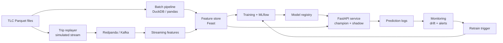
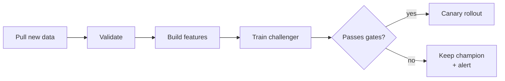

# Hands-On Project: Build a Production ML System (NYC Taxi ETA)

## Project overview

You'll build **TaxiETA**, a small but complete production ML system that predicts how long a New York taxi trip will take, the moment it starts. The project goes through the whole lifecycle from *Designing Machine Learning Systems*: framing, data pipelines, training data, features, models, serving, monitoring, retraining and responsible AI. It runs on a laptop with public data and open-source tools.

**Why ETA on NYC taxi data?** It's one of the book's own running examples (Google Maps ETA, DoorDash delivery time). It also exercises nearly every concept for real:

- **Natural labels with a feedback loop.** The true duration arrives when the trip ends (Ch. 4, 9).
- **Time-correlated data.** A random split leaks, so you have to split by time (Ch. 5).
- **Batch and streaming features.** A zone's historical average speed is a batch feature; its speed over the last 15 minutes is a streaming feature (Ch. 3, 7).
- **A real distribution shift.** Trips from 2019 and from spring 2020 (COVID) change dramatically, which gives you a natural drift experiment (Ch. 8, 9).
- **A rare-event side task.** “Will this trip run over 60 minutes?” is heavily imbalanced, so you practice imbalance, calibration and thresholds (Ch. 4, 6).
- **A fairness question.** Does the model serve all boroughs equally well (Ch. 6, 11)?

### What you'll have at the end



The loop at the bottom (monitoring, then retraining) is the part most courses skip. It's the heart of Chapters 8 and 9.

### Milestones and the chapters they practice

| Milestone | You build | Chapters | Est. time |
| --- | --- | --- | --- |
| 1. Framing & requirements | Design doc: objectives, metrics, SLOs | 1, 2 | 0.5 day |
| 2. Data engineering | Parquet lake, DuckDB queries, trip replayer to Kafka | 3 | 2 days |
| 3. Training data | Sampling study, weak-supervision labels, imbalanced side task | 4 | 2 days |
| 4. Features & leakage | Feature pipeline, time-based split, leakage hunt | 5 | 2 days |
| 5. Model development | Baselines → GBM, MLflow tracking, calibration, slices | 6 | 3 days |
| 6. Deployment | FastAPI online service, batch job, quantized model | 7 | 2 days |
| 7. Monitoring | Drift detection on the 2020 replay, dashboards, alerts | 8 | 2 days |
| 8. Continual learning | Stateless vs. stateful retraining, shadow/canary/A-B, bandit | 9 | 3 days |
| 9. Infrastructure | Docker Compose, Airflow 3 DAGs, Feast, model store | 10 | 2 days |
| 10. Responsible AI & UX | Model card, fairness audit, fallback model | 11 | 1 day |

Plan for about 4–5 weeks part-time. Each milestone lists **tasks** (tick them off), a **deliverable**, **questions to answer** in your own words (this is where the learning sticks), and optional **stretch goals**. Keep a `LEARNING_LOG.md` in the repo and answer the questions there as you go.

## Setup

### Dataset: NYC TLC Trip Record Data

The [NYC Taxi & Limousine Commission](https://www.nyc.gov/site/tlc/about/tlc-trip-record-data.page) publishes every yellow-taxi trip as monthly **Parquet** files, also mirrored on the [AWS Open Data Registry](https://registry.opendata.aws/nyc-tlc-trip-records-pds/). Each row has pickup and dropoff timestamps, pickup and dropoff zone IDs, trip distance, passenger count, fare, tip and payment type. The columns are defined in the [yellow-taxi data dictionary](https://www.nyc.gov/assets/tlc/downloads/pdf/data_dictionary_trip_records_yellow.pdf).

Download with plain URLs (the same pattern works for any year-month):

```bash
mkdir -p data/raw && cd data/raw
for m in 01 02 03 04 05 06; do
  curl -O https://d37ci6vzurychx.cloudfront.net/trip-data/yellow_tripdata_2019-$m.parquet
done
for m in 01 02 03 04 05 06; do
  curl -O https://d37ci6vzurychx.cloudfront.net/trip-data/yellow_tripdata_2020-$m.parquet
done
curl -O https://d37ci6vzurychx.cloudfront.net/misc/taxi_zone_lookup.csv
```

**How you'll use the months:**

| Period | Role in the project |
| --- | --- |
| Jan–Apr 2019 | Training and validation (split by time) |
| May–Jun 2019 | Held-out test set, plus the “production” stream for Milestones 6–7 |
| Jan–Jun 2020 | The “future” you replay to see a real distribution shift in Milestones 7–8 |

The 2020 files make a natural drift experiment. Yellow-cab trips in and around Manhattan fell about 92% in spring 2020 compared with 2019 ([Findings](https://findingspress.org/article/22158-changing-demand-for-new-york-yellow-cabs-during-the-covid-19-pandemic)). The average yellow-taxi trip distance rose from 2.4 to 4.8 miles between February and May 2020 ([Pith summary of arXiv 2009.14018](https://pith.science/paper/2009.14018)). Your model trained on 2019 will meet very different inputs (covariate shift) and very different traffic, so the same route can take a different time (concept drift).

**Laptop tip:** a 2019 month is several million rows. Down-sample to 5–10% while developing. Doing that correctly is itself a Chapter 4 exercise (Milestone 3).

**Problem assumption:** like a ride-hailing app, you assume the rider enters a destination zone before the trip starts. So at prediction time you know the pickup time, pickup zone and dropoff zone. You do **not** know the dropoff time, the metered distance, the fare or the tip. Keep that list handy: it's your leakage checklist.

### Tool stack (all free or open source)

| Layer | Tool | Used in |
| --- | --- | --- |
| Language / env | Python 3.11+, `uv` or conda, pinned `requirements.txt` | All |
| Batch storage & SQL | Parquet + DuckDB (pandas or Polars for dataframes) | M2–M4 |
| Streaming | Redpanda (Kafka-compatible, one Docker container) + `confluent-kafka` or `kafka-python` | M2, M6–M8 |
| Data validation | pandera or Great Expectations | M2, M7 |
| Weak supervision | Snorkel | M3 |
| Models | scikit-learn, LightGBM, optionally PyTorch | M5 |
| Experiment tracking & model registry | MLflow | M5, M8, M9 |
| Serving | FastAPI + Uvicorn; ONNX Runtime for the compressed model | M6 |
| Monitoring | SciPy (KS test), Evidently or alibi-detect, Prometheus + Grafana (optional) | M7 |
| Orchestration | Apache Airflow 3.3 (airflow standalone in Docker; Task SDK, assets, branching) | M8–M9 |
| Feature store | Feast (local mode) | M9 |
| Packaging | Docker + Docker Compose | M6, M9 |

Don't install everything on day one. Add each tool in the milestone that introduces it, so you feel the problem it solves before you adopt it.

### Repository layout

```text
taxieta/
├── README.md                  # quick start, stack URLs, milestone → file map
├── LEARNING_LOG.md            # every milestone's questions + result tables to fill
├── Makefile                   # setup, fixture, download, ingest, train, serve, test, up
├── docker-compose.yml         # redpanda, console, mlflow, api, consumer, airflow
├── docker/                    # app image + Airflow 3 image (TaxiETA in its own venv)
├── dags/                      # Airflow 3 DAGs: ingest → monitoring → retrain (M9)
├── docs/                      # design_doc (M1), model_card + ownership (M10), build_vs_buy (M9)
├── src/taxieta/
│   ├── ingest/                # download, validate, write lake, synthetic fixture (M2)
│   ├── stream/                # events, replayer, zone-speed consumer, online store (M2, M6)
│   ├── labeling/              # samplers, label joiner, Snorkel LFs (M3, M8)
│   ├── features/              # one feature definition used by train AND serve (M4)
│   ├── training/              # baselines, time split, LightGBM, metrics, slices (M5)
│   ├── serving/               # FastAPI app, fallback, prediction log, batch job (M6, M10)
│   ├── monitoring/            # KS / PSI drift report (M7)
│   ├── continual/             # evaluation gates, promotion, Thompson sampler (M8)
│   └── model_store.py         # versioned models + metadata + champion pointer (M5, M9)
├── scripts/                   # DAG import check, crontab example (M9)
├── tests/                     # leak firewall, stream, sampling, API, gates (18 tests)
└── .github/, .devcontainer/   # CI (tests + DAG parsing) and a reproducible dev env
```

The rule that matters most is in `src/taxieta/features/`: the **same feature code** must serve training and inference. Chapter 7 names two separate pipelines as a top source of production bugs.

### Starter repo

The starter repo (`taxieta-starter.zip`, sent in chat) already contains this layout. The plumbing works: download and validation, the Parquet lake, DuckDB queries, the trip replayer and zone-speed consumer, shared features with a leak-firewall test, a LightGBM trainer with baselines and slices, the FastAPI service with heuristic fallback and prediction log, KS/PSI drift checks, evaluation gates, and three **Airflow 3.3** DAGs. The learning work is marked `TODO(M1)` … `TODO(M10)` in the code. Run `grep -rn "TODO(M4)" src dags` to see what's yours for a milestone.

**Reference solutions** (taxieta-solutions.zip, sent in chat): the same repo plus a `solutions` branch with one tagged commit per milestone (`solution-m1` … `solution-m10`). After finishing a milestone, compare with `git diff solution-m4 solution-m5`, run `taxieta solve m5` to reproduce every experiment as a report, and read `docs/solutions/M5.md` for the walkthrough, what to expect on real data, and answers to the learning-log questions. To pull the solutions into your own starter repo: `git fetch <path-to>/taxieta-solutions solutions:solutions --tags`.

```bash
unzip taxieta-starter.zip && cd taxieta
make setup                                # uv venv + project + dev tools
make fixture MONTHS=2019-01:2019-06,2020-03:2020-04   # synthetic data, no download needed
.venv/bin/taxieta ingest --months 2019-01:2019-06,2020-03:2020-04
make train && make test && make serve     # champion v0001, 18 tests, API on :8000
make download && make ingest SAMPLE=0.1   # then switch to the real TLC data
make up                                   # Redpanda, MLflow, API, consumer, Airflow 3 (localhost:8080)
```

The three DAGs are chained by assets rather than clocks. `taxieta_ingest` emits a LAKE asset event carrying the month. `taxieta_monitoring` runs the drift check and emits DRIFT only when it finds a shift. `taxieta_retrain` trains a challenger, runs the gates, and branches to *promote* or *keep champion*. That's Chapter 9's drift-triggered continual learning, in Airflow 3's Task SDK (`airflow.sdk`: `@dag`, `@task.bash`, `@task.branch`, `Asset`, `Metadata`). Airflow and TaxiETA run in **separate Python environments**: tasks call the `taxieta` CLI, so the two dependency sets never collide (Ch. 10).

The synthetic fixture data exists only to test the plumbing, offline or in CI. Draw modelling conclusions only from the real TLC files.

## Milestone 1 — Framing and requirements (Ch. 1–2)

**Goal:** decide *why* the system exists and what “good” means before you write any model code. Output: a 2–3 page `docs/design_doc.md`.

### Tasks

- [ ] **Is ML the right tool?** Go through the book's checklist: learn, complex patterns, existing data, predictive, unseen data resembles training data, repetitive, cheap mistakes, at scale, patterns that change. Write one line on how ETA fits each point.
- [ ] **Write a non-ML heuristic first.** For example: *ETA = median duration of historical trips for this (pickup zone, dropoff zone, hour-of-week)*, falling back to distance between zone centroids ÷ citywide median speed. This becomes Phase 1 of the four phases of model development (Ch. 6).
- [ ] **Invent the business context and stakeholders.** Pretend you're a ride-hailing company. List 4–5 stakeholders (rider app PM, dispatch/ops, pricing, platform/infra, compliance) and the requirement each one cares about. Mark each requirement must-have or nice-to-have.
- [ ] **Map business metric → ML metric.** Business: fewer cancellations caused by inaccurate ETAs; rider trust. ML: MAE in minutes, and the **% of trips within ±20%** of actual duration. Decide which ML metric you'd report to a manager and why.
- [ ] **Frame the ML task.** Inputs (what's known at pickup), output (duration in seconds), objective (MAE or Huber loss; consider predicting log-duration). Also frame the side task, **LongTrip**: binary classification of “duration > 60 min”.
- [ ] **Write requirements for the four properties:**
  - *Reliability:* what happens if the model service is down or slow? (Answer: the heuristic fallback, built in M10.)
  - *Scalability:* peak requests per second. Estimate it from the busiest hour in the data.
  - *Maintainability:* who owns what? What gets versioned?
  - *Adaptability:* how will you know the model is stale?
- [ ] **Set SLOs.** Example: p50 latency < 50 ms, p99 < 200 ms, 99.9% availability, MAE within 10% of the offline value over any 24-hour window.
- [ ] **Decouple objectives.** Suppose ops also wants to *never badly underestimate* long trips. Write down whether you'd use one model with a combined loss or two models whose scores you combine, and why (Ch. 2, “Decoupling objectives”).

### Deliverable

`docs/design_doc.md` with sections: Problem, Why ML, Stakeholders & requirements, Metrics (business + ML), Task framing, SLOs, Risks, Baseline plan.

### Questions to answer in your learning log

1. Why is “% within ±20%” closer to the business than RMSE?
2. Name one way the model could hit its ML metric and still hurt the business.
3. Your latency SLO is written with percentiles. Why not the average?
4. Why might a regression framing, with the destination as an *input* feature, beat one classifier per destination? (Recall the “next app” example in Ch. 2.)

### Stretch

Compute the heuristic's MAE on May 2019 now. Every later model must beat this number to justify its complexity.

## Milestone 2 — Data engineering (Ch. 3)

**Goal:** turn raw monthly files into a clean, validated data lake you can query, and build a **trip replayer** that streams historical trips as if they were happening live. After this milestone you have both *historical* data (batch) and *streaming* data.

### Tasks

**A. Formats and storage**

- [ ] Export one month to CSV and compare it with the Parquet original: file size, time to load all columns, time to load only 3 columns. Record the numbers in your log. (Ch. 3: row-major vs. column-major, text vs. binary.)
- [ ] Time iterating a pandas DataFrame **by row** (`iterrows`) vs. **by column**, then convert to NumPy and repeat. Explain the difference using the book's pandas-is-column-major point.
- [ ] Build `data/lake/trips/` as Parquet partitioned by `year=/month=`. Join `taxi_zone_lookup.csv` to add borough and zone names.

**B. ETL with validation**

- [ ] Write an **extract** step that validates each file and rejects bad rows, counting them by reason. The data has plenty of them:
  - dropoff time before pickup time
  - duration ≤ 0 or > 6 hours
  - pickup timestamps outside the file's month
  - zone IDs 264/265 (unknown zones)
  - `passenger_count` of 0 or null
- [ ] Express the rules as a pandera (or Great Expectations) schema: “unit tests for data” (Ch. 8).
- [ ] **Transform:** compute `duration_s`, `pickup_hour`, `pickup_dow`, pickup and dropoff borough. **Load** to the lake. Note in your log which steps you'd call ETL and which ELT.
- [ ] Query the lake with DuckDB. Answer these three questions with SQL (OLAP-style aggregations): average duration by hour of week, the busiest 10 zones, and the share of airport trips (JFK, LaGuardia, Newark).

```sql
-- DuckDB reads partitioned Parquet directly
SELECT pickup_dow, pickup_hour,
       median(duration_s)/60 AS median_min, count(*) AS n
FROM read_parquet('data/lake/trips/*/*/*.parquet', hive_partitioning=1)
WHERE year = 2019 AND month <= 4
GROUP BY ALL ORDER BY pickup_dow, pickup_hour;
```

**C. Streaming: the trip replayer**

- [ ] Run Redpanda in Docker. It speaks the Kafka API. Check Redpanda's quickstart for current flags; a single-node dev setup is enough.

```bash
docker run -d --name redpanda -p 9092:9092 redpandadata/redpanda:latest \
  redpanda start --overprovisioned --smp 1 --memory 1G \
  --kafka-addr PLAINTEXT://0.0.0.0:9092 --advertise-kafka-addr PLAINTEXT://localhost:9092
```

- [ ] Write `stream/replayer.py`. It reads a month in timestamp order and publishes **two event types** to two topics, with a speed-up factor (e.g., 60×: 1 real second = 1 simulated minute):
  - `trip_started` at the pickup time: `trip_id`, pickup time, pickup zone, dropoff zone. **Only what's known at pickup.**
  - `trip_completed` at the dropoff time: `trip_id`, dropoff time, distance, fare. This is the **natural label** arriving later.
- [ ] Write a consumer that keeps a **streaming feature**: for each pickup zone, the median speed of trips *completed* in the last 15 simulated minutes. Store it in a dict or SQLite and print it every simulated minute.
- [ ] Compute the same feature in **batch** from the lake for one day, then compare it with the streaming version. Do they match exactly? Every mismatch is a train/serve skew bug in miniature (Ch. 7).

### Deliverable

`make ingest` builds a validated lake with a rejection report. `make replay MONTH=2019-05` streams trips into Redpanda while the consumer prints live zone speeds.

### Questions to answer in your learning log

1. Which format would you use for training data, and which for appending events one by one? Why?
2. Your prediction service needs zone speeds from the consumer. Compare the three **dataflow modes** (through a database, through a service request, through a real-time transport) for this exact case.
3. Which of your features are **batch (static)** and which are **streaming (dynamic)**?
4. Why does the label (`trip_completed`) arrive on a different schedule from the features? What does that imply for training?

### Stretch

Write the zone-speed feature once in a way that runs in both batch and streaming mode (for example, a pure function over a window of events). Flink's maintainers argue that “batch is a special case of streaming.” Do you agree after trying it?

## Milestone 3 — Training data (Ch. 4)

**Goal:** create training data on purpose instead of “whatever loads”. You'll sample it, label it (natural labels plus weak supervision), track where it came from, and face class imbalance on the LongTrip side task.

### Tasks

**A. Sampling**

- [ ] Take three 5% samples of Jan–Apr 2019: **simple random**, **stratified** by pickup borough, and **convenience** (only the first 5 days of each month). For each, compare the borough mix and the duration distribution against the full data. Which sample is biased, and how? Staten Island and airport trips are your rare strata.
- [ ] **Weighted sampling:** give recent weeks 2× weight and justify it (“recent data is more valuable”). You'll test that claim properly in M8.
- [ ] **Reservoir sampling on the stream:** keep a uniform sample of k = 10,000 trips from the replayer without knowing the stream length. Verify it's uniform by comparing hour-of-day histograms with the full month.

```python
import random

def reservoir(stream, k):
    sample = []
    for n, item in enumerate(stream, start=1):
        if n <= k:
            sample.append(item)
        else:
            i = random.randint(1, n)      # 1 <= i <= n
            if i <= k:
                sample[i - 1] = item      # each item kept with prob k/n
    return sample
```

**B. Labels**

- [ ] **Natural labels via label computation.** Write `labeling/join_labels.py`. It joins `trip_started` and `trip_completed` events by `trip_id` to produce (features-at-pickup, true duration) rows. Measure the **feedback loop length** distribution (the median and p99 of time until the label arrives).
- [ ] **Label window trade-off:** if you close the join after 30 minutes, what share of trips have no label yet? What bias does that create? (Long trips are systematically missing, which is the same underestimation the book describes for delayed ad clicks.)
- [ ] **Weak supervision (Snorkel).** Some “trips” are really meter errors or fraud. Write 5–8 **labeling functions** that vote INVALID / VALID / ABSTAIN, for example:
  - implied speed > 80 mph
  - distance = 0 but fare > $20
  - pickup zone = dropoff zone, but the trip lasts over 2 hours
  - fare far below the minimum for its duration
- [ ] Combine them with Snorkel's `LabelModel`. Hand-label 200 trips yourself as ground truth and report each LF's coverage, conflicts and accuracy, plus the combined model's accuracy.
- [ ] **Label multiplicity:** have a friend (or yourself, a week later, without looking) label the same 50 borderline trips. Compute the agreement rate. Write a one-paragraph labeling guideline that would resolve your disagreements.
- [ ] **Data lineage:** every training row carries `source_file`, `ingest_version` and `label_source` (natural / LF / hand). You'll use these to debug later.

**C. Class imbalance: the LongTrip side task**

- [ ] Compute the positive rate for “duration > 60 min”. Show that the **zero-rule** model (always “no”) gets very high accuracy and zero recall.
- [ ] Train LightGBM four ways and compare **precision, recall, F1 and PR-AUC** on the minority class (never plain accuracy):
  1. plain
  2. random **undersampling** of the majority class — *after* splitting, and never on the evaluation set
  3. **class-balanced weights** (`class_weight='balanced'` or `scale_pos_weight`)
  4. **focal loss** (custom objective) or **two-phase learning** (train on balanced data, then fine-tune on the original)
- [ ] Plot the **ROC** and **precision–recall** curves for the best model. Explain why the PR curve is more informative here.
- [ ] Write a cost matrix: missing a long trip costs X, a false alarm costs Y. Pick the decision threshold that minimizes expected cost (cost-sensitive thinking, Ch. 4).

### Deliverable

`data/train/` Parquet with lineage columns, a Snorkel LF report, and an imbalance comparison table in the log.

### Questions to answer in your learning log

1. Which nonprobability sampling method did your convenience sample resemble? What bias did it introduce?
2. When is weak supervision a better investment than more hand labels? When is it worse?
3. Why must resampling happen after the train/test split?
4. Does undersampling change your model's predicted probabilities? What does that mean for calibration (Milestone 5)?

### Stretch

**Active learning:** train LongTrip on 1,000 labeled rows, then add 500 more chosen by (a) random selection and (b) lowest confidence. Compare PR-AUC, then repeat 5 rounds and plot the learning curves.

## Milestone 4 — Feature engineering and data leakage (Ch. 5)

**Goal:** build one feature pipeline shared by training and serving, and **deliberately fall into leakage traps** so you learn to spot them. This milestone gives the most “aha” per hour.

### Tasks

**A. Core features** (in `features/`, pure functions of what's known at pickup)

- [ ] **Time:** hour, day of week, holiday flag, and `is_rush_hour` (7–9 a.m., 4–6 p.m.). Also encode hour **cyclically** with sin/cos. That's the same idea as the fixed positional embeddings and Fourier features in Ch. 5. Compare it with a raw integer hour.
- [ ] **Location:** pickup and dropoff zone IDs, boroughs, an airport flag, and the straight-line distance between zone centroids (you'll need zone shapefiles or centroids; the TLC publishes zone maps).
- [ ] **Feature cross:** (pickup zone × dropoff zone) has up to \~70,000 values. Encode it with the **hashing trick** (e.g., 2¹⁸ buckets via `sklearn.feature_extraction.FeatureHasher`). Measure how the collision rate and MAE change with 2¹², 2¹⁶ and 2²⁰ buckets.
- [ ] **Historical (batch) features:** median duration for (zone pair, hour-of-week) computed over *past* weeks only.
- [ ] **Streaming features:** pickup-zone median speed over the last 15 minutes, from M2, joined **as of** the pickup timestamp (a point-in-time join).
- [ ] **Target transform:** train on log(duration), since durations are right-skewed. Compare MAE in minutes with and without it.

**B. Missing values and scaling**

- [ ] List the columns with nulls. For each, guess whether it's MCAR, MAR or MNAR and justify the guess (e.g., null `passenger_count` clusters in certain vendors or months → MAR?). Choose deletion or imputation per column, and **never impute with a possible value** such as 0 passengers without adding a missing-indicator flag.
- [ ] Scale numeric features (min-max, standardization) and check whether it matters for linear regression vs. LightGBM.

**C. The leakage lab** (run each experiment and record the numbers)

| # | Experiment | What to observe |
| --- | --- | --- |
| 1 | Add `trip_distance`, `fare_amount` or `tip_amount` as features | MAE collapses. These are only known after the trip: label leakage. |
| 2 | **Random** split vs. **time** split (Jan–Mar train, first half of April validation, second half test) | The random split looks better offline. Explain why future information leaked. |
| 3 | Fit the scaler or imputer on **all** data vs. **train only** | A small but real optimistic bias. |
| 4 | Compute the “historical median duration” feature using data that includes the target week | Suspiciously good results: leakage through aggregates. |
| 5 | Check for exact duplicate trips across splits | Count them, then dedupe *before* splitting. |

- [ ] **Detect leakage without knowing the answer:** rank features by importance, run **ablations** on the top 3, and look for any single feature with implausibly high predictive power. Write the rule you'd add to code review to catch this.

**D. Importance and generalization**

- [ ] Compute **SHAP** values for the LightGBM model (M5 can reuse them). Which few features carry most of the importance?
- [ ] **Coverage and distribution check:** for every feature, compare its coverage and value range between train and test. Reproduce the book's warning: train only on Monday–Saturday and test on Sunday with a one-hot day-of-week. What happens?
- [ ] Compare `hour` with `is_rush_hour` (specific vs. generalizable) and write down the trade-off.

### Deliverable

`features/build.py` produces training features from the lake *and* is imported by the serving code. `LEARNING_LOG.md` has the leakage-lab table filled in with your numbers.

### Questions to answer in your learning log

1. Why is splitting by time mandatory here and optional for, say, classifying photos of cats?
2. Which of your features would you drop if the streaming pipeline went down? What would you fall back to?
3. You added a feature and MAE improved 30%. List three checks you run before celebrating.
4. What are the costs of *too many* features in production (Ch. 5 lists five)?

### Stretch

Learn **zone embeddings**: train a small neural net with an embedding layer for zone IDs, then plot the 2-D projection. Do Manhattan zones cluster together?

## Milestone 5 — Model development and offline evaluation (Ch. 6)

**Goal:** walk through the **four phases** of model development with disciplined tracking, then evaluate far beyond one MAE number: baselines, robustness, calibration, confidence and slices.

### Tasks

**A. Four phases, tracked in MLflow**

- [ ] Start a local MLflow server (`mlflow server --backend-store-uri sqlite:///mlflow.db`). Every run logs: params, metrics per split, the Git commit, the training-data version/lineage, the feature list, a random seed, and artifacts (loss curves, residual plots).
- [ ] **Phase 1, no ML:** the heuristic from M1.
- [ ] **Phase 2, simple ML:** linear regression on one-hot and cyclical features, then LightGBM with defaults.
- [ ] **Phase 3, optimize simple models:** hyperparameter search with Optuna, Ray Tune or random search. Tune on **validation only**; touch the test set once at the end. Try a Huber loss vs. L2 on log-duration.
- [ ] **Phase 4, complex model:** a small PyTorch MLP with zone embeddings. Give it the **same tuning budget** (same number of trials) as LightGBM, which avoids the human bias the book warns about.
- [ ] Plot **learning curves** (validation MAE vs. training-set size: 1%, 5%, 10%, 25%, 50%). Which model would benefit most from more data?

**B. Debugging discipline**

- [ ] For the MLP: **overfit a single batch** of 256 rows to near-zero loss before training for real, and fix seeds for Python, NumPy and PyTorch.
- [ ] Deliberately introduce one bug, e.g., forgetting `model.eval()` / `torch.no_grad()` or shuffling labels against features. Note how “silently” it fails.

**C. Ensembles**

- [ ] Measure the **correlation of errors** between LightGBM, the MLP and the heuristic. Build a simple averaging ensemble and a **stacked** ensemble (a linear meta-learner trained on validation predictions). Does the gain justify the extra serving complexity and latency?

**D. Baselines table** (the top of your evaluation report)

| Baseline | How to compute |
| --- | --- |
| Random | Predict a duration sampled from the training label distribution |
| Zero rule | Always predict the training median |
| Simple heuristic | Zone-pair × hour-of-week median (M1) |
| Existing solution | Pretend the heuristic is the current production system |
| Human | Optional: guess 30 ETAs yourself with a map; how close are you? |

**E. Evaluation beyond MAE**

- [ ] **Perturbation test:** add ±2 minutes of noise to pickup time and swap 5% of zones for a neighbouring zone. Which model degrades least? That's the one that will be easier to maintain.
- [ ] **Invariance test:** `VendorID` and payment type shouldn't change an ETA made at pickup. Shuffle them and measure how much predictions move. If they're features at all, question why.
- [ ] **Directional expectation test:** for the same pickup, a farther dropoff zone should never predict a *shorter* trip on average, and rush hour shouldn't be faster than 3 a.m. Automate both as assertions.
- [ ] **Calibration (LongTrip classifier from M3):** plot `sklearn.calibration.calibration_curve`. Recalibrate with Platt scaling or isotonic regression (`CalibratedClassifierCV`) and compare before and after. Explain why the undersampled model from M3 was badly calibrated.
- [ ] **Confidence:** train quantile models (LightGBM `objective='quantile'`, α = 0.1 and 0.9) to output a range such as “14–19 min”. Measure **interval coverage** (it should be ≈ 80%). Decide what the app shows when the interval is too wide.
- [ ] **Slice-based evaluation:** report MAE and % within ±20% by pickup borough, airport vs. non-airport, hour bucket and trip length. Find the worst slice. Check whether a model that wins overall loses on every slice (**Simpson's paradox**).

### Deliverable

An MLflow experiment with every run reproducible from its logged commit and data version. `reports/offline_eval.md` contains the baselines table, the model comparison, the robustness and calibration results, and slice tables. You also have a chosen **champion** registered in the MLflow Model Registry.

### Questions to answer in your learning log

1. Did the complex model beat LightGBM by enough to justify its cost? Which evidence decided it?
2. Which assumption of your best model (IID, smoothness, …) is violated by this data?
3. What did slicing reveal that the overall metric hid?
4. Is your system *good*, *useful*, both, or neither? Compare it against the baselines.

### Stretch

Train LightGBM with data parallelism across processes (Ray or Dask), or use gradient checkpointing for the MLP, and record the speedup vs. the added complexity.

## Milestone 6 — Deployment and prediction service (Ch. 7)

**Goal:** serve the champion two ways, **online** (with streaming features) and **batch**, measure latency like a production engineer, and shrink the model with compression.

### Tasks

**A. Online prediction service**

- [ ] Build `serving/app.py` with FastAPI. `POST /predict` takes `{pickup_time, pickup_zone, dropoff_zone}`. It builds features by **importing the same `features/` code** used in training, fetches the latest zone speed from the streaming consumer's store, loads the champion from the MLflow registry at startup, and returns `{eta_seconds, interval, model_version, request_id}`.
- [ ] **Log every prediction** (request\_id, timestamp, model\_version, full feature vector, prediction) to a Parquet or SQLite “prediction log”. Monitoring, label joining and retraining all depend on this log.
- [ ] Wire it to the stream: a consumer calls `/predict` on each `trip_started` event. The label joiner from M3 later matches each prediction to its `trip_completed` event.
- [ ] Containerize the service (`Dockerfile`, pinned dependencies) and add it to `docker-compose.yml` with Redpanda and MLflow.

**B. Measure it like production**

- [ ] Load-test with `locust` or `hey` at 10, 50 and 200 requests/s. Report **p50, p90, p99 latency** and throughput, never just the average.
- [ ] Add server-side micro-batching (collect requests for up to 10 ms, predict together). Show the latency vs. throughput trade-off from Ch. 1.
- [ ] Find where the time goes: feature fetch vs. model inference vs. serialization. Chapter 7's claim that network and I/O often dominate inference is worth verifying yourself.

**C. Batch prediction**

- [ ] Write `serving/batch.py`. It precomputes ETAs for the 1,000 most frequent zone pairs × 168 hours-of-week into a table, and the API serves from it on a hit or falls back to online prediction on a miss (the hybrid pattern).
- [ ] Compare the batch table with online predictions during a simulated traffic spike (replay a snowy or holiday day). Batch can't see live zone speeds. Quantify how much worse it gets.

**D. Model compression**

- [ ] Export the MLP (or LightGBM via `onnxmltools`) to **ONNX** and serve it with ONNX Runtime. Compare latency with native inference.
- [ ] **Quantize** the ONNX MLP to int8 (`onnxruntime.quantization.quantize_dynamic`). Build this table:

| Variant | Model size (MB) | p50 latency (ms) | MAE (min) | Worst-slice MAE |
| --- | --- | --- | --- | --- |
| Original (fp32) |  |  |  |  |
| ONNX fp32 |  |  |  |  |
| ONNX int8 |  |  |  |  |
| Distilled student |  |  |  |  |

- [ ] **Knowledge distillation:** train a small LightGBM (few, shallow trees) on the *ensemble's* predictions instead of true labels. How close does it get to the teacher?
- [ ] Fill the **worst-slice** column honestly. Compression can hurt rare slices more than the average (you'll come back to this in M10).

### Deliverable

`docker compose up` starts Redpanda, MLflow and the API. A replay drives live predictions into the prediction log. `reports/serving.md` holds the latency percentiles and the compression table.

### Questions to answer in your learning log

1. Which of the three prediction modes is your system: batch, online with batch features, or streaming prediction? Why?
2. Where would two separate pipelines (training vs. serving) have crept in if you hadn't shared the `features/` code?
3. When would you choose batch prediction for ETA, despite its staleness?
4. Which deployment myth (one model, no decay, rare updates, no scale) did this milestone disprove for you?

### Stretch

Run the ONNX model **in the browser** with ONNX Runtime Web (WebAssembly) on a tiny HTML page. Compare latency with the server, and note what edge deployment means for privacy and cost.

## Milestone 7 — Distribution shift and monitoring (Ch. 8)

**Goal:** watch your 2019 model meet 2020, detect the shift *before* labels confirm it, tell real drift apart from your own bugs, and build alerts people won't ignore.

### Tasks

**A. Build the monitoring job** (`monitoring/`, run every simulated hour and day)

Monitor all four artifacts from the book, from rawest to closest-to-business:

- [ ] **Raw inputs:** rejection counts per validation rule from M2 (a spike means upstream trouble).
- [ ] **Features:** schema checks (pandera) plus summary stats (min, max, mean, quantiles, null rate) per feature, compared against the training reference.
- [ ] **Predictions:** the distribution of predicted ETAs, and odd patterns (e.g., 10 identical predictions in a row).
- [ ] **Accuracy:** MAE and % within ±20%, computed once the label joiner has delayed labels. Track **how late** the metric is.
- [ ] **Operational metrics:** request rate, error rate, p50/p99 latency. Expose `/metrics` for Prometheus and build a small Grafana dashboard (optional), or just plot them with matplotlib.

**B. Statistical drift detection**

- [ ] Run a two-sample **Kolmogorov–Smirnov** test (`scipy.stats.ks_2samp`) on predictions and on each numeric feature: reference = validation weeks, current = each day.
- [ ] For categorical features (pickup zone, borough), use a chi-square test or the Population Stability Index.
- [ ] For multivariate drift, try MMD from **alibi-detect**, or **Evidently**'s data-drift report, after reducing dimensions (PCA on the feature vector).
- [ ] **Windows:** compare hourly vs. daily windows, and **sliding vs. cumulative** accuracy. Show a cumulative metric hiding a sharp dip.
- [ ] **Seasonality false alarms:** comparing a Sunday against weekday reference data looks like drift. Fix it by comparing against the same hour-of-week, and count how many false alarms disappear.

**C. The 2020 experiment**

- [ ] Replay **May–Jun 2019** (a quiet baseline), then **Jan–Jun 2020**. Record the date each detector first fires, compared with the date MAE degradation becomes visible from labels.
- [ ] Diagnose the shift in the book's terms, with evidence:
  - **Covariate shift:** P(X) changes, e.g., the zone mix and the share of airport and outer-borough trips.
  - **Label shift:** P(Y) changes, e.g., the duration distribution.
  - **Concept drift:** P(Y | X) changes. The same zone pair at the same hour now takes a *different* time because traffic changed. Show it by comparing median duration per (zone pair, hour) between 2019 and 2020.

**D. Tell drift apart from bugs**

- [ ] Inject three **internal errors** during a replay and check which monitors catch each:
  1. A “deploy” that changes a feature's unit (seconds → milliseconds).
  2. The streaming consumer dies, so zone speed goes stale or null.
  3. The wrong model version gets loaded.
- [ ] Write down how you'd tell each apart from genuine drift. (Recall the estimate in Ch. 8 that \~80% of detected drift is human error.)

**E. Alerts and observability**

- [ ] Define alerts, each with a **policy** (condition + duration), a **channel** (console, email or a Slack webhook), and a **description with a runbook link**. For example: *p99 latency > 200 ms for 10 minutes*, or *daily MAE > 1.2× reference for 2 consecutive days*.
- [ ] Count alerts per simulated day across 2019. If there are more than a couple a day, tune thresholds: you're causing **alert fatigue**.
- [ ] **Observability:** make sure the prediction log can answer, without new code: *“show the trips with the largest errors in the last hour, grouped by pickup borough”* and *“show every intermediate feature for request X”*.

### Deliverable

`reports/drift_2020.md`: a timeline chart of the detectors vs. actual MAE, the shift diagnosis, the bug-injection results and the alert rules.

### Questions to answer in your learning log

1. Which monitor gave the **earliest useful** warning, and which gave the most false alarms?
2. Imagine the app shows ETAs and riders cancel when the ETA is long. Only accepted trips then become training data. Describe the **degenerate feedback loop** this could create, and one way to correct it.
3. Give an **edge case** for this system that isn't an outlier, and an outlier that isn't an edge case.
4. Why is monitoring feature distributions useful for debugging but weak for detecting performance drops?

### Stretch

Implement **root-cause hints**: when accuracy drops, automatically rank features by drift score and slices by error increase, and print the top 3 of each.

## Milestone 8 — Continual learning and test in production (Ch. 9)

**Goal:** make the system adapt to 2020 on its own, and promote new models safely using live traffic. You'll climb the book's **four stages** of continual learning and try every test-in-production technique that fits a regression model.

### Tasks

**A. How often should you retrain? Measure it**

- [ ] **Value of data freshness:** fix a test week (e.g., the last week of June 2019). Train identical models on 4-week windows ending 1, 2, 4 and 8 weeks before it, and plot MAE vs. data age. Repeat with a test week in May 2020. How does the curve change when the world is shifting?
- [ ] **Model iteration vs. data iteration:** compare (a) retraining the same LightGBM on fresh data and (b) a better architecture on stale data. Which gives more MAE improvement per unit of compute?

**B. Climb the four stages**

- [ ] **Stage 1 (manual, stateless):** retrain by hand once and time every step. Every step you found painful is something to automate.
- [ ] **Stage 2 (automated, stateless):** `continual/retrain.py` runs end to end: pull labeled data from the prediction log plus the label joiner, build features (**reuse the logged features: “log and wait”**), train, evaluate, and register a **challenger**. Schedule it daily in simulated time.
- [ ] **Stage 3 (stateful):** continue training from the champion instead of starting from scratch. For LightGBM, pass `init_model=` to add trees on the newest day; for the MLP, fine-tune from the checkpoint. Compare **compute time** and MAE against stateless retraining over 8 simulated weeks of 2020. (Grubhub cut training compute 45× this way.) Add a periodic full retrain from scratch to recalibrate.
- [ ] Record **model lineage**: each version stores its parent version and the data window it saw (e.g., `v2.0 → v2.1 → v2.2`). MLflow tags work.
- [ ] **Stage 4 (triggered):** replace the fixed schedule with triggers and compare them on the 2020 replay by final MAE and number of retrains:
  - *time-based:* every day
  - *performance-based:* MAE > 1.2× reference
  - *volume-based:* 5% more labeled data
  - *drift-based:* your M7 detector fires

**C. Evaluation gates before promotion**

- [ ] Every challenger must pass, automatically and in order: (1) the **static test set** (sanity), (2) a **backtest** on the most recent labeled day, (3) no slice worse than the champion by more than X%, (4) the directional and invariance tests from M5. Log a pass/fail report per gate, like CI/CD for models.
- [ ] Think about **adversarial data**: drivers who could influence labels (e.g., idling with the meter running). Add one guardrail, such as capping how much a single day of data can move the model.

**D. Test in production**

- [ ] **Shadow deployment:** the API calls champion and challenger for every request, returns only the champion's answer, and logs both. Compare them on joined labels after one simulated day. Note the doubled inference cost.
- [ ] **Canary release:** route 5% → 25% → 50% → 100% of traffic to the challenger, advancing every simulated few hours only if its live MAE is no worse. Otherwise **abort** and roll back automatically.
- [ ] **A/B test:** assign each trip to A or B by hashing `trip_id` (true randomization; don't split by borough or time). Compare absolute errors with a two-sample test or a bootstrap confidence interval, and estimate the sample size you needed.
- [ ] **Bandit:** treat three models (heuristic, champion, challenger) as arms. Reward = 1 if the prediction lands within ±20%. Use **Thompson sampling** with Beta priors, then compare how many trips it needs to find the best model vs. your A/B test, and how much error it cost along the way.

```python
import numpy as np

alpha = np.ones(3)   # successes + 1 per arm
beta = np.ones(3)    # failures + 1 per arm

def choose_arm():
    return int(np.argmax(np.random.beta(alpha, beta)))

def update(arm, reward):   # reward in {0, 1}, known when the trip completes
    alpha[arm] += reward
    beta[arm] += 1 - reward
```

Note the delayed reward: the bandit only updates when `trip_completed` arrives, which is a short feedback loop in the book's terms.

### Deliverable

A 2020 replay in which the system detects drift, retrains, gates, canaries and promotes models with no manual steps. `reports/continual.md` has the freshness curve, the stateless vs. stateful comparison, the trigger comparison and the A/B vs. bandit results.

### Questions to answer in your learning log

1. For this system, is the real answer to “how often should I retrain?” a schedule or a trigger? Use your measurements.
2. Why isn't interleaving a natural fit here, when it is for recommenders? What would you need to change to use it?
3. What was the biggest bottleneck to faster updates: fresh data, labels, evaluation time or compute?
4. When would you still choose shadow deployment over a canary, despite the cost?

### Stretch

Add a **contextual bandit** (e.g., LinUCB) that picks the model per request based on context (borough, hour). Does per-context routing beat a single global winner?

## Milestone 9 — Infrastructure and tooling (Ch. 10)

**Goal:** replace the scripts and glue from earlier milestones with real infrastructure: a standardized dev environment, orchestrated workflows, a feature store and a complete model store. Then reflect on build vs. buy.

### Tasks

**A. Dev environment**

- [ ] Pin **every** dependency (including the Python version) and add a `.devcontainer/` so the repo opens identically in VS Code Dev Containers or GitHub Codespaces. Test it on a clean machine or container. (Remember the author's Python 3.8 vs. 3.9 bug story.)
- [ ] Add CI (GitHub Actions): lint, unit tests, **data tests** (pandera schemas on a small fixture), and the directional/invariance model tests from M5, run on every push.
- [ ] Convert exploration notebooks into modules, and keep notebooks only for analysis. Try Papermill to run one notebook with different parameters.

**B. From cron to orchestrator**

- [ ] First schedule the daily jobs with **cron** (ingest → features → retrain → batch predict → monitor). Break one step on purpose and notice that cron has no idea the next steps shouldn't run.
- [ ] Rebuild the pipeline as **Airflow 3 DAGs (the starter repo ships three, chained by assets: ingest → monitoring → retrain**): tasks with dependencies, retries, parameters (e.g., `train_window_days`) and a **conditional step**: *deploy the challenger if it passes the gates, otherwise keep the champion and alert*.



- [ ] Split the featurizing and training steps into **separate containers** with different resources (memory-heavy CPU vs. compute-heavy), even if both run locally, and explain why that matters at scale.

**C. Feature store (Feast, local mode)**

- [ ] Define entities (`pickup_zone`, `zone_pair`) and feature views:
  - **batch:** historical zone-pair × hour-of-week durations from the Parquet offline store
  - **streaming:** a push source for the live zone speed from your Redpanda consumer
- [ ] Generate training data with `get_historical_features` (**point-in-time correct** joins, which remove the M4 aggregate leakage by construction). Change the API to read with `get_online_features`.
- [ ] Verify **feature consistency**: sample 1,000 logged requests and recompute their features offline. They should match exactly.

**D. Model store**

- [ ] Make sure every registered model stores all **eight artifacts** the book lists:
  1. model definition
  2. parameters
  3. featurize and predict code
  4. dependencies (container image tag)
  5. data version
  6. generation code (Git commit)
  7. experiment artifacts
  8. tags (owner, task)
- [ ] Run the book's debugging drill: pick a production prediction from the log and reproduce it exactly on your laptop using only what the model store holds.

**E. Build vs. buy memo**

- [ ] Write a one-page `docs/build_vs_buy.md`. For each component (compute, streaming, feature store, model registry, serving, monitoring), name the open-source piece you used and a managed alternative (e.g., SageMaker, Vertex AI, Databricks, Tecton, Confluent). Decide for a hypothetical 20-person startup and for a bank, using the book's three factors: company stage, competitive focus and tool maturity.

### Deliverable

`make up` runs the whole system, with Airflow 3 at `localhost:8080`. Triggering `taxieta_ingest` for a 2020 month flows through monitoring into a drift-triggered retrain with gates. A new contributor can go from clone to a running replay in under 30 minutes by following the README.

### Questions to answer in your learning log

1. Explain the difference between a **scheduler** and an **orchestrator** using the components you actually ran.
2. Which of the three feature-store problems (management, computation, consistency) did Feast solve for you, and which didn't it solve?
3. Which Airflow drawback from the book (monolithic, not parameterized, static DAGs) still applies to Airflow 3, and which were fixed? (Test it: Param, dynamic task mapping, per-task environments.)
4. What would change if this ran on Kubernetes in the cloud instead of Docker Compose on a laptop?

### Stretch

Rewrite the retrain flow in **Metaflow**, using `@conda` and `@resources` decorators, and compare the experience with Airflow 3. Or run the stack on a local Kubernetes cluster with `kind`.

## Milestone 10 — UX, teams and responsible AI (Ch. 11)

**Goal:** make the system pleasant and safe for the people who use it and the people it affects, and document it so someone else could take it over.

### Tasks

**A. User experience**

- [ ] **Consistency:** the app refreshes the ETA every 30 seconds during a trip. Simulate it and count how often the displayed ETA jumps by more than 2 minutes. Add a rule: change the display only if the new prediction differs by more than X minutes or a new event occurred (e.g., the zone changed). Measure the **consistency–accuracy trade-off** you just made.
- [ ] **“Mostly correct” predictions:** show a range from your quantile models (“14–19 min”) instead of a single number when uncertainty is high. Decide who could correct a bad ETA (a dispatcher override?), which is a small human-in-the-loop design.
- [ ] **Smooth failing:** if the model takes more than 100 ms, or the streaming features are missing, or the model service is down, the API answers with the **heuristic backup** and flags `fallback=true`. Test all three failure paths and measure how much accuracy you lose (the **speed–accuracy trade-off**).

**B. Team handoff**

- [ ] Write `docs/ownership.md`: who owns data, labels, features, models, the platform and on-call, plus a short runbook for your top 3 alerts. Then role-play the book's two team structures. As a “separate ops team”, could someone deploy and debug your model from the docs alone? What would an end-to-end data scientist need from the tooling instead?
- [ ] **Subject matter expertise:** read or watch something about how NYC traffic actually works (bridge and tunnel tolls, airport taxi queues, rush-hour patterns). Turn at least two insights into features or labeling functions, and note that the domain knowledge is now versioned in code.

**C. Responsible AI audit** (follow the book's framework)

- [ ] **Discover bias sources:** go through training data, labeling, features, objective and evaluation. Write one line per stage about where bias could enter for TaxiETA (e.g., far fewer outer-borough trips in yellow-taxi data, so less data for those riders).
- [ ] **Fairness by slice:** compare MAE and % within ±20% for Manhattan vs. the Bronx, Brooklyn, Queens and Staten Island. If this ETA fed dispatch or pricing, what harm would an error gap cause, and for whom? Try one mitigation (reweighting, per-borough calibration or an objective that penalizes the worst slice) and report its cost to overall MAE.
- [ ] **Compactness vs. fairness:** repeat the slice comparison for the int8 and distilled models from M6. Did compression hurt the rare slices more than the average?
- [ ] **Privacy:** trip records are “anonymized”, yet pickup and dropoff locations with timestamps can reveal routines. Remember the Strava heatmap lesson. List which fields your prediction log stores, set a retention period, and justify defaulting to the least data needed. Note that stateful training (M8) could let you avoid storing raw trips long-term.
- [ ] **Model card:** write `docs/model_card.md` using the Mitchell et al. template:
  - model details
  - intended use and out-of-scope uses (e.g., “not for driver performance evaluation”)
  - factors (borough, time, airport)
  - metrics and decision thresholds
  - evaluation data
  - training data summary
  - quantitative analyses (unitary and intersectional, e.g., borough × rush hour)
  - ethical considerations
  - caveats and recommendations
- [ ] **Automate the model card:** generate its metric tables from MLflow in the retrain DAG, so every new model version ships with an updated card.

### Deliverable

The fallback path works and is tested, plus `docs/ownership.md`, `docs/model_card.md` and `reports/fairness.md`.

### Questions to answer in your learning log

1. Name one decision this system should **never** automate, even if the model is accurate.
2. Which trade-off from Ch. 11 (privacy–accuracy, compactness–fairness, consistency–accuracy, speed–accuracy) was hardest to decide, and why?
3. What in your model card would you want a stakeholder to read *before* using the model?
4. Why is “act early” cheaper than fixing fairness after launch? Point to a place in your own pipeline.

### Stretch

Train the historical zone-pair aggregates with **differential privacy** (e.g., add calibrated Laplace noise to counts and medians, or use a DP library) and measure accuracy loss per borough. Is the loss uneven, as Bagdasaryan & Shmatikov found?

## Schedule, final deliverables and self-check

### Suggested 5-week schedule (about 10–12 hours a week)

| Week | Milestones | End-of-week demo |
| --- | --- | --- |
| 1 | M1, M2 | Validated lake; the replayer streams trips into Redpanda |
| 2 | M3, M4 | Training data with lineage; the leakage-lab table is filled in |
| 3 | M5, M6 | Champion in MLflow; the API serves live predictions from the stream |
| 4 | M7, M8 | The 2020 replay detects drift and retrains with canary promotion |
| 5 | M9, M10 | One-command stack, feature store, model card, fairness report |

**Short on time? The 2-week core path:** M1 → M2 (A, B) → M4 (A, C) → M5 (A, D, E) → M6 (A) → M7 (A–C) → M8 (A, stage 2, shadow deployment) → M10 (model card). This still covers the ideas the book stresses most: time splits and leakage, baselines, slices, drift and retraining.

### Final deliverables

- [ ] Public (or private) Git repo with a README that gets a newcomer to a running replay in under 30 minutes
- [ ] `docs/design_doc.md`, `docs/model_card.md`, `docs/ownership.md`, `docs/build_vs_buy.md`
- [ ] `reports/`: offline evaluation, serving and compression, drift 2020, continual learning, fairness
- [ ] `LEARNING_LOG.md` with all of the milestone questions answered in your own words
- [ ] A 10-minute demo, recorded or live: replay 2020 and narrate what the system detects and how it responds

### Self-check rubric

You've understood the book when you can do each of these **with your own project as the example**:

| Topic (chapter) | You can… |
| --- | --- |
| Framing (1–2) | Tie an ML metric to a business metric and explain why you chose it over alternatives |
| Data engineering (3) | Justify the storage format and dataflow mode; show a batch feature and a streaming feature computing the same thing |
| Training data (4) | Explain a sampling bias you found, your label pipeline and its feedback delay, and how you handled imbalance |
| Features (5) | Reproduce at least three leakage traps and explain how your pipeline now prevents them |
| Model development (6) | Show the four phases, fair comparisons, baselines, calibration and a slice your model struggles with |
| Deployment (7) | Report p50/p99 latency, explain your prediction mode, and show the compression trade-offs |
| Monitoring (8) | Point to the day drift was detected, classify the shift, and tell it apart from an injected bug |
| Continual learning (9) | Show measured data-freshness value, stateful vs. stateless savings, and a safe promotion with rollback |
| Infrastructure (10) | Explain scheduler vs. orchestrator, what the feature store and model store guarantee, and your build-vs-buy call |
| Human side (11) | Walk through your model card, fairness findings, fallback path and one decision you refuse to automate |

When you finish a milestone, reread that chapter's section of your chapter notes. You'll find it reads very differently once you've hit the problems yourself.

## Sources

- [TLC Trip Record Data](https://www.nyc.gov/site/tlc/about/tlc-trip-record-data.page): official download page for the NYC trip records
- [Yellow taxi trip records data dictionary (PDF)](https://www.nyc.gov/assets/tlc/downloads/pdf/data_dictionary_trip_records_yellow.pdf)
- [NYC TLC Trip Record Data, Registry of Open Data on AWS](https://registry.opendata.aws/nyc-tlc-trip-records-pds/): Parquet format, `nyc-tlc` S3 bucket
- [Dustin Vannoy, “First Spark SQL Application”](https://dustinvannoy.com/2023/05/18/first-spark-sql-application/): example of the `d37ci6vzurychx.cloudfront.net/trip-data/` download URL
- [nyc-taxi-operations-analytics (GitHub)](https://github.com/himasriyaengu/nyc-taxi-operations-analytics): example of the `taxi_zone_lookup.csv` URL
- [“Changing Demand for New York Yellow Cabs during the COVID-19 Pandemic”, Findings](https://findingspress.org/article/22158-changing-demand-for-new-york-yellow-cabs-during-the-covid-19-pandemic): 92% drop in Manhattan-related yellow-cab trips, 2020 vs. 2019
- [“Toward the New Normal…” (arXiv 2009.14018), Pith summary](https://pith.science/paper/2009.14018): yellow-taxi trip distance rose from 2.4 to 4.8 miles, February to May 2020
- [Apache Airflow Quick Start (3.3.2 docs)](https://airflow.apache.org/docs/apache-airflow/stable/start.html): install with constraints, `airflow standalone`, supported Python versions
- [apache-airflow on PyPI](https://pypi.org/project/apache-airflow/): 3.3.2 released September 17, 2026
- [Airflow asset-aware scheduling](https://airflow.apache.org/docs/apache-airflow/stable/authoring-and-scheduling/asset-scheduling.html) and the [TaskFlow tutorial](https://airflow.apache.org/docs/apache-airflow/stable/tutorial/taskflow.html): `airflow.sdk` imports, assets, `triggering_asset_events`
- Chip Huyen, *Designing Machine Learning Systems* (O'Reilly, 2022): the chapter concepts each milestone practices
